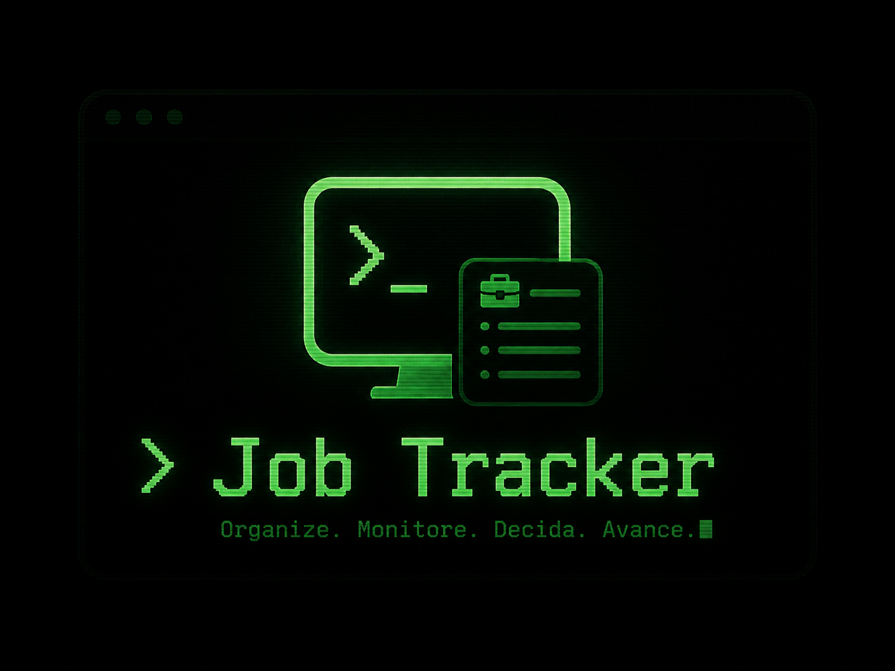

# Job Tracker

[English version](README.en.md)




Job Tracker é um produto pessoal, local-first, para organizar o processo de busca por vagas com menos atrito e mais contexto. Em vez de ser apenas um board de candidaturas, ele combina perfil profissional estruturado, monitoramento manual de job boards, classificação assistida por IA e analytics para ajudar a responder uma pergunta mais útil: onde meu processo está funcionando e onde ele está quebrando?

## Visão Geral

O sistema foi desenhado para uso single-user, com foco em privacidade, velocidade de iteração e baixo custo operacional. Os dados ficam em SQLite local e a aplicação roda como um web app full-stack em Next.js.

Hoje o produto já entrega um fluxo funcional de ponta a ponta para:

- manter um perfil profissional estruturado a partir do currículo em PDF;
- cadastrar empresas e acompanhar status de interesse;
- rodar um radar manual de vagas em job boards;
- triar leads descobertos automaticamente antes de virarem candidaturas;
- acompanhar candidaturas em um board com histórico de etapas;
- visualizar métricas e sinais do funil em um dashboard analítico.

## Fluxos Principais

### 1. Perfil profissional

O usuário envia o currículo master em PDF, o texto é extraído, estruturado com IA e salvo em uma base editável dentro do app. A revisão é feita inline por seção, sem depender de arquivos externos.

### 2. Radar manual de vagas

Empresas podem ser cadastradas com `jobsBoardUrl`. A varredura é acionada manualmente, descobre links de vagas, extrai sinais estruturados da descrição e classifica o fit com o perfil salvo.

### 3. Caixa de triagem de leads

Vagas classificadas como relevantes ou duvidosas entram em `/leads`, onde o usuário decide se aprova, descarta ou promove o lead para o pipeline de candidatura.

### 4. Pipeline de candidaturas

As candidaturas são acompanhadas em uma interface visual com status, modal de detalhes, histórico de etapas e informações operacionais do processo seletivo.

### 5. Dashboard

O dashboard consolida backlog, funil, distribuição de classificações, timeline do radar, top companies, aderência de work model e qualidade do classificador.

## Destaques Técnicos

- `Next.js 16` com App Router e Server Actions para manter UI e lógica de backend no mesmo repositório.
- `SQLite + Drizzle ORM` para persistência local simples, rápida e fácil de versionar por migrations.
- `TanStack Query` no módulo de leads para hidratação inicial sem flicker e invalidação seletiva.
- `SSE` para refletir progresso do radar em tempo real sem precisar de workers ou filas externas.
- `Ollama` para classificação de leads e geração/seleção textual associada ao currículo.
- `OpenAI` no fluxo atual de extração de perfil e, opcionalmente, na formatação de descrições de vagas.
- `Playwright + fetch + cheerio` para lidar com boards mais simples e boards com navegação mais dinâmica.

## Arquitetura

```text
UI (Next.js / React)
  -> Server Actions + Route Handlers
  -> SQLite (Drizzle)
  -> File system local (uploads, backups)
  -> Ollama runtime (local ou cloud)
  -> OpenAI API (extração de perfil e formatação opcional)
```

Algumas decisões de arquitetura importantes:

- `local-first`: o projeto foi pensado para uso pessoal, sem dependência de auth, sync em nuvem ou infraestrutura complexa.
- `manual by design`: o radar é disparado pelo usuário, sem cron ou background jobs nesta fase.
- `separação entre lead e candidatura`: nem toda vaga descoberta vira candidatura; existe uma caixa de triagem intermediária.
- `real-time suficiente, sem over-engineering`: SSE resolve o feedback do radar com uma solução simples e adequada ao problema.

## Stack

| Camada | Tecnologia |
| --- | --- |
| Frontend | Next.js 16, React 19, TypeScript |
| UI | Tailwind CSS 4, Base UI, shadcn/ui, Lucide |
| Estado client-side | TanStack Query |
| Banco | SQLite |
| ORM | Drizzle ORM |
| IA | Ollama, OpenAI |
| Extração / scraping | fetch, cheerio, Playwright |
| Gráficos | Recharts |

## Estrutura do Projeto

```text
src/
  app/
    (app)/
      dashboard/
      profile/
      companies/
      leads/
      applications/
    api/
  components/
  lib/
    ai/
    db/
    job-monitoring/
    profile/
  providers/
  server/
    actions/
scripts/
docs/
public/
uploads/
```

Arquivos úteis para navegar pelo código:

- [src/lib/job-monitoring/index.ts](src/lib/job-monitoring/index.ts)
- [src/lib/job-monitoring/classification.ts](src/lib/job-monitoring/classification.ts)
- [src/app/api/monitoring/stream/route.ts](src/app/api/monitoring/stream/route.ts)
- [src/components/leads/monitoring-progress-context.tsx](src/components/leads/monitoring-progress-context.tsx)
- [src/server/actions/profile.ts](src/server/actions/profile.ts)
- [src/server/queries/dashboard.ts](src/server/queries/dashboard.ts)
- [docs/radar-manual-de-vagas-implementacao.md](docs/radar-manual-de-vagas-implementacao.md)

## Executando Localmente

### 1. Instalação

```bash
npm install
cp .env.example .env.local
```

### 2. Banco de dados

```bash
npm run db:migrate
```

Se você for alterar schema ou migrations, faça backup antes:

```bash
npm run db:backup
```

### 3. Suba a aplicação

```bash
npm run dev
```

Abra [http://localhost:3000](http://localhost:3000).

## Variáveis de Ambiente

O arquivo `.env.example` documenta a configuração mínima. Em alto nível:

- `DATABASE_URL`: caminho do banco SQLite local.
- `OPENAI_API_KEY`: necessário no fluxo atual de extração de perfil.
- `OPENAI_COMPARISON_MODEL`: modelo opcional para comparações e utilitários OpenAI.
- `OPENAI_FORMAT_JOB_DESCRIPTIONS`: habilita formatação opcional de descrições.
- `OLLAMA_RUNTIME_MODE`: `local` ou `cloud`.
- `OLLAMA_BASE_URL`: endpoint do runtime Ollama.
- `OLLAMA_MODEL`: modelo usado na classificação e geração textual.
- `OLLAMA_API_KEY`: obrigatório quando o modo é `cloud`.
- `OLLAMA_TIMEOUT_MS`: timeout das chamadas ao Ollama.
- `UPLOADS_PATH`: diretório base de uploads locais.

## Scripts Úteis

```bash
npm run dev
npm run build
npm run lint
npm run db:generate
npm run db:migrate
npm run db:backup
npm run db:restore
npm run test:job-monitoring
npm run test:profile-extraction
npm run analyze:profile-extractions
npm run resume:sample
```

## Escopo Atual

O repositório representa um produto pessoal já funcional, mas não tenta resolver tudo:

- não há autenticação ou multi-tenant;
- não há sincronização em nuvem;
- o radar continua manual, sem agendamento;
- a cobertura de job boards pode crescer com mais adapters;
- o produto prioriza clareza operacional e velocidade de uso antes de automação pesada.

## Roadmap

Próximos passos naturais do produto:

- ampliar cobertura de providers e navegação de job boards;
- evoluir a geração de currículo customizado dentro do fluxo de candidatura;
- aprofundar analytics de diagnóstico do funil;
- refinar heurísticas e feedback loop do classificador.

## Portfólio

Este projeto existe porque eu queria uma ferramenta que refletisse meu processo real de job hunting, não um CRUD genérico. O ponto mais interessante dele, para mim, é a combinação entre product thinking e pragmatismo técnico: IA onde ela realmente agrega, dados locais por padrão, e uma arquitetura simples o bastante para continuar evoluindo rápido.
