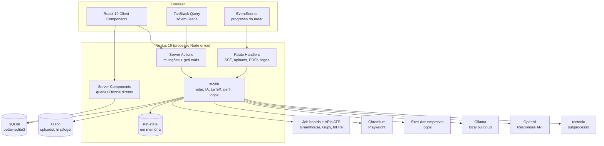

# Arquitetura

Aplicação Next.js full-stack, single-user, sem autenticação. UI, lógica de servidor, banco e jobs de scraping/IA vivem no mesmo processo Node.

## Visão em camadas



## Padrões de acesso a dados

| Necessidade | Mecanismo | Exemplos |
|---|---|---|
| Ler dados para a página | Server Component com query Drizzle direta, `export const dynamic = "force-dynamic"` | todas as páginas de `src/app/(app)/` |
| Mutar dados | Server Action (`"use server"`) + `revalidatePath` | `src/server/actions/*.ts` |
| Refetch no cliente | Server Action como `queryFn` do TanStack Query | `getLeads()` |
| Stream, binário, upload multipart | Route Handler | `/api/monitoring/*`, `/api/profile/upload`, `/api/applications/[id]/*`, `/api/companies/[id]/logo` |
| Métricas agregadas | módulo de queries | `src/server/queries/dashboard.ts` |

Regras que o código segue:

- Não existe camada de API REST para CRUD. Tudo que é JSON puro passa por Server Action.
- Server Actions validam entrada (`Number.isInteger`, `new URL`, enums) e, em geral, devolvem resultados tipados (`{ success }`, `{ ok }`) em vez de lançar para a UI. Exceções: `createCompany` usa `redirect()`, e `approveLead`/`discardLead` não retornam nada.
- Depois de mutar, revalidam as rotas afetadas. Trio comum: `/companies`, `/applications`, `/leads` (`revalidateRadarViews`).
- Módulos que só podem rodar no servidor importam `server-only` (`company-links.ts`, `profile/queries.ts`, `profile/upload.ts`, `applications/resume-upload.ts`).
- Route Handlers que usam APIs do Node declaram `export const runtime = "nodejs"`. Parâmetros dinâmicos são `params: Promise<{ id: string }>` com `await` (Next 15+).

## Estado no cliente

- **URL como estado** para abas, filtros e modais (`tab`, `status`, `companyId`, `q`, `leadId`, `applicationId`, `range`), escrita via `useSearchParamsUpdater` (History API, sem round-trip ao servidor). Modais são deep-linkáveis.
- **TanStack Query** só na tela de leads (`queryKey: ["leads"]`, `initialData` do servidor, `staleTime: 30_000`, updates otimistas).
- **Contexto React** para o progresso do radar (`MonitoringProgressProvider`), montado no layout `(app)` para sobreviver à navegação.
- Demais telas: props do Server Component + `router.refresh()`.

Hierarquia de providers:

```text
RootLayout (src/app/layout.tsx)
  <html lang="pt-BR"> + script anti-flash de tema no <head>
  QueryProvider
    TooltipProvider
      (app) layout (src/app/(app)/layout.tsx)
        MonitoringProgressProvider      ← usa useQueryClient(), precisa estar dentro do QueryProvider
          SidebarProvider
            AppSidebar | SidebarInset (conteúdo) | MobileNav
    Toaster (sonner)
```

## Estado em memória no servidor

| Singleton | Onde | Observação |
|---|---|---|
| Conexão SQLite / Drizzle | `src/lib/db/index.ts` | em dev guardada em `globalThis` (HMR) |
| Run do radar | `src/lib/job-monitoring/run-state.ts` | variável de módulo; some em restart; um processo |
| Buscas de logo em andamento | `src/lib/company-logos.ts` (`inflightLookups`) | dedup de requisições simultâneas |

Tudo assume **um único processo**. Escalar horizontalmente quebraria run-state e o SQLite local.

## Estrutura de pastas

```text
src/
  app/
    layout.tsx, globals.css, page.tsx (→ /dashboard), ícones
    (app)/                      grupo com sidebar/nav
      layout.tsx
      dashboard/ profile/ companies/ (+ [id], new) leads/ applications/
    api/
      monitoring/stream|current
      profile/upload
      applications/[id]/resume|generated-resume
      companies/[id]/logo
  components/
    ui/                         primitives (shadcn/Base UI + próprios)
    leads/ applications/ companies/ dashboard/ profile/
    app-sidebar.tsx, mobile-nav.tsx, page-header.tsx, theme-toggle.tsx
  hooks/                        use-theme, use-media-query, use-mobile, use-search-params-updater
  lib/
    db/                         schema, cliente, migrations
    job-monitoring/             radar (discovery, providers/, extraction, signals, classification, persistence, run-state, logger)
    ai/                         ollama, openai, resume-generation
    latex/                      template, render, escape, adapter, fixtures
    profile/                    queries, editor, upload
    applications/               create-application-record, resume-upload
    job-leads/                  mapper
    applications.ts companies.ts jobs.ts job-leads.ts   enums + labels
    company-links.ts company-logos.ts navigation.ts theme.ts utils.ts
  providers/query-provider.tsx
  server/
    actions/                    applications, companies, job-monitoring, leads, profile, resume
    queries/dashboard.ts
scripts/                        backup-db.sh, restore-db.sh, render-resume-sample.ts
deploy/                         deploy.sh, install.sh, systemd/, README.md
docs/                           esta documentação
public/brand/                   monograma e máscara do logo
uploads/                        PDFs e logos (gitignored, exceto .gitkeep)
backups/                        backups locais (gitignored)
tmp/                            scratch, logs de extração, DBs de preview (gitignored)
.specs/                         especificação original (spec, design, tasks) — histórica
.claude/ .codex/ .agents/       harness de agentes (ver harness-de-agentes.md)
```

## Configuração do Next

[`next.config.ts`](../next.config.ts):

- `serverExternalPackages: ["better-sqlite3", "pdfjs-dist"]`: módulos nativos/pesados fora do bundle.
- `outputFileTracingIncludes` com `uploads/**` e os arquivos do SQLite do projeto (provável resquício de quando banco e uploads viviam só dentro do repo; em produção eles ficam fora da release).
- `turbopack.root` fixo na raiz do projeto; `dev` e `build` usam `--turbopack`.
- `allowedDevOrigins` com um IP da rede local, para abrir o dev server no celular.
- `devIndicators` no canto superior esquerdo (o inferior cobriria a tab bar mobile).

## Segurança

- **Sem autenticação.** Quem alcança a porta tem acesso total, inclusive às Server Actions. A proteção é de rede: em produção o Next escuta só em `127.0.0.1` e é exposto apenas dentro do tailnet via `tailscale serve` (nunca `funnel`). Ver [deploy-e-operacao.md](deploy-e-operacao.md).
- Segredos só em `.env.local` (dev) e `/etc/job-tracker/env` (VPS). O repositório GitHub é **público**: nunca commitar env, banco, uploads, nome do tailnet ou URL de produção.
- Busca de logos com proteção SSRF (bloqueio de IPs internos, redirects manuais) e resposta com CSP `sandbox`.
- LaTeX: todo texto do perfil/IA é escapado; URLs validadas antes de entrar em `\href`.
- Markdown de vagas renderizado sem HTML cru (`react-markdown` sem rehype).
- `/api/monitoring/stream` responde `Access-Control-Allow-Origin: *`; como não há auth, qualquer página aberta no mesmo navegador/rede poderia disparar um scan.

## Decisões de arquitetura

| Decisão | Motivo |
|---|---|
| Local-first, single-user, SQLite | uso pessoal, privacidade, custo zero, backup trivial |
| Lead separado de candidatura | nem toda vaga descoberta merece candidatura; triagem explícita |
| SSE em vez de WebSocket/fila | progresso unidirecional basta; sem infra extra |
| Radar manual (por enquanto) | controle e custo; agendamento é o próximo passo |
| Server Actions em vez de API REST | menos código; tipos compartilhados |
| `initialData` + `staleTime` nos leads | zero flicker e sem refetch durante scan |
| VPS (Oracle A1) + Tailscale, não Vercel | SQLite em disco, Playwright/Chromium, SSE longo, tectonic; acesso privado sem porta pública |
| Deploy pull-based na VPS | nenhuma credencial do servidor/tailnet no GitHub |

Histórico e datas em [roadmap-e-decisoes.md](roadmap-e-decisoes.md).
