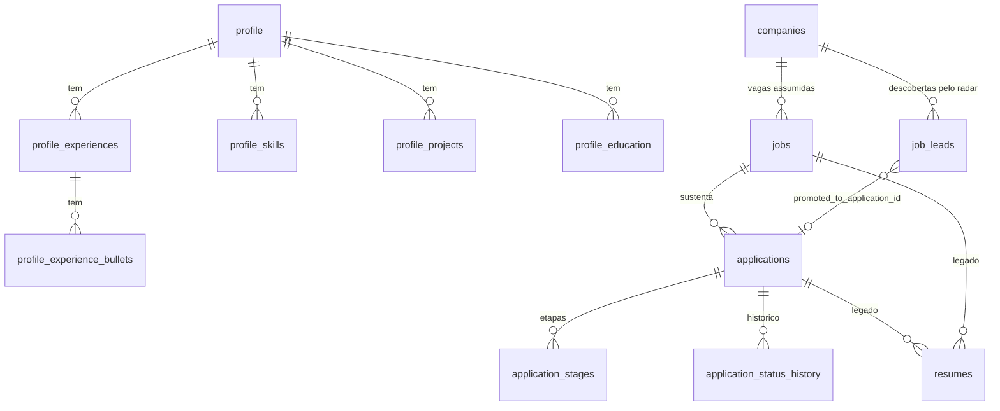

# Banco de dados

SQLite acessado com `better-sqlite3` (API síncrona) e Drizzle ORM. O schema vive em [`src/lib/db/schema.ts`](../src/lib/db/schema.ts) e as migrations em [`src/lib/db/migrations/`](../src/lib/db/migrations/).

> Antes de qualquer mudança de schema ou migration: `npm run db:backup`. O hook `pre-schema-edit.sh` lembra disso ao editar `schema.ts`.

## Cliente e conexão

[`src/lib/db/index.ts`](../src/lib/db/index.ts):

- Caminho do arquivo: `DATABASE_URL` (default `./job-tracker.db`, relativo ao `cwd` do processo).
- Em `NODE_ENV=production` o banco abre com `fileMustExist: true`. Um `DATABASE_URL` errado gera erro explícito em vez de criar um banco vazio (fail closed, commit `1a1d311`).
- Em dev, `sqlite` e `db` ficam cacheados em `globalThis` para sobreviver ao HMR sem abrir conexões novas.
- Exporta `db` (Drizzle com `schema`, habilita `db.query.*` relacional) e `sqlite` (handle bruto).

Comportamentos do SQLite que importam:

| Item | Estado | Consequência |
|---|---|---|
| `foreign_keys` | **ligado** (default do `better-sqlite3`) | Deletar linha referenciada falha. Ex.: `deleteCompany` apaga `job_leads` antes da empresa. |
| `journal_mode` | o código **não** configura WAL. O DB local verificado em 2026-09-27 está em `delete` | Documentação antiga citava WAL; não confie nisso. |
| Concorrência | todas as queries rodam síncronas no event loop de um único processo Node | O `pLimit(5)` do radar paraleliza I/O de rede, não escritas. `SQLITE_BUSY` só aparece com outro processo segurando lock (CLI `sqlite3`, `drizzle-kit`, backup). |

## Convenções

- **Datas**: colunas `integer(..., { mode: "timestamp" })` guardam **segundos Unix**; o Drizzle converte para `Date`. `job_leads.last_viewed` tem default SQL `(unixepoch())`.
- **Datas do perfil** (`start_date`, `end_date`) são `text` no formato `YYYY-MM`.
- **Listas** são JSON serializado em `text`: `profile_experience_bullets.tags`, `profile_projects.stack` (`string[]`). O parse tolerante está em `parseJsonStringArray` ([`src/lib/profile/queries.ts`](../src/lib/profile/queries.ts)).
- **Enums** são `text` validado na aplicação (não há `CHECK` no banco). As listas de valores ficam em `src/lib/*.ts` (tabelas abaixo).
- **Booleanos**: `integer({ mode: "boolean" })` (0/1).
- FKs declaradas com `ON UPDATE/DELETE no action`. Não existe cascade no banco; a aplicação apaga dependentes explicitamente.

## Diagrama



## Tabelas

### Perfil (single-user)

Só existe um perfil na prática. `getProfileSnapshot()` lê o registro com `updated_at` mais recente e carrega os filhos via `db.query.profile.findFirst({ with: ... })`.

| Tabela | Colunas relevantes |
|---|---|
| `profile` | `full_name` (obrigatório), `email`, `phone`, `linkedin`, `github`, `location`, `work_model_preference` (`remote`/`hybrid`/`onsite`), `company_type_preference`, `values_preference`, `notes`, `master_resume_path`, `created_at`, `updated_at` |
| `profile_experiences` | `profile_id`, `company`, `role`, `start_date` (`YYYY-MM`), `end_date`, `is_current`, `description` |
| `profile_experience_bullets` | `experience_id`, `content`, `tags` (JSON) |
| `profile_skills` | `profile_id`, `name`, `level` (`beginner`/`intermediate`/`advanced`/`expert`), `years_experience`, `category` (`language`/`framework`/`tool`/`soft-skill`) |
| `profile_projects` | `profile_id`, `name`, `description`, `stack` (JSON), `url`, `impact` |
| `profile_education` | `profile_id`, `institution`, `degree`, `field`, `start_date`, `end_date` |

Opções e labels: [`src/lib/profile/editor.ts`](../src/lib/profile/editor.ts).

### `companies`

| Coluna | Tipo / default | Uso |
|---|---|---|
| `name` | text, obrigatório | |
| `website`, `sector`, `size`, `glassdoor_url`, `notes` | text | `size`: `startup`/`small`/`medium`/`large`/`enterprise` |
| `jobs_board_url` | text | Entrada do radar. Sem URL válida a empresa não é varrida. |
| `job_board_navigation_mode` | text, `fetch` | `fetch` (HTML estático) ou `browser` (Playwright). |
| `ats_provider` | text, `auto` | `auto`, `greenhouse`, `gupy`, `inhire`, `ashby`, `lever`, `generic`. |
| `ats_board_token` | text | Salvo e repassado ao radar, mas **nenhum provider lê**: o token do Greenhouse sai da própria URL. |
| `status` | text, `monitoring` | `monitoring`, `in_process`, `discarded`, `blacklist`. Derivado das candidaturas (ver abaixo). |
| `origin` | text, `manual` | `manual` (cadastrada pelo usuário), `aggregator` (criada por uma fonte agregada) ou `yc_import` (script de importação). Migration `0018`. |
| `logo_url`, `logo_path`, `logo_checked_at` | text/text/timestamp | Logos (migration `0015`). Ver [modulos/empresas.md](modulos/empresas.md). |

**Status derivado** — `deriveCompanyStatus` ([`src/lib/companies.ts`](../src/lib/companies.ts)) roda via `syncCompanyStatus` sempre que uma candidatura é criada ou muda de status:

1. `blacklist` é fixo: nunca é sobrescrito.
2. Alguma candidatura ativa (`applied`, `in_process`, `offer`, `approved`) → `in_process`.
3. Há candidaturas, mas nenhuma ativa → `discarded`.
4. Sem candidaturas → mantém o status atual, exceto `discarded`, que volta para `monitoring`.

O status também decide o radar em lote: `discarded` e `blacklist` ficam de fora (`radarSkippedCompanyStatuses` em `src/lib/companies.ts`, desde `cb455cc`). A varredura individual pelo detalhe da empresa ignora o status.

### `jobs` e `applications`

Uma candidatura sempre aponta para um `job` (a vaga assumida). Os dois são criados juntos por `createApplicationRecord` ([`src/lib/applications/create-application-record.ts`](../src/lib/applications/create-application-record.ts)), usado tanto no cadastro manual quanto na promoção de lead.

`jobs`:

| Coluna | Observação |
|---|---|
| `company_id` | obrigatório desde `0004` |
| `company` | nome denormalizado (legado de antes de `company_id`; ainda usado para religar jobs antigos por nome) |
| `title`, `description` (markdown), `seniority`, `work_model`, `salary_min`, `salary_max`, `source_name`, `source_url` | `source_name`: `linkedin`, `gupy`, `catho`, `company_site`, `other` |
| `status` | default `interesting`; `createApplicationRecord` grava `applied`. Sem uso funcional hoje. |

`applications`:

| Coluna | Observação |
|---|---|
| `job_id` | FK obrigatória |
| `status` | `applied` (Aplicada), `in_process` (Em processo), `offer` (Oferta), `approved` (Aprovada), `rejected` (Rejeitada), `withdrawn` (Desistiu). O legado `interesting` é normalizado para `applied`. |
| `applied_at` | preenchido na primeira vez que o status vira `applied` via `updateApplicationStatus` |
| `is_referral` | boolean, default `false` |
| `used_resume_status` | `unknown` (default), `empty`, `uploaded` |
| `used_resume_path`, `used_resume_original_filename` | PDF enviado para a candidatura (caminho relativo ao `cwd`) |
| `generated_resume_path` | PDF gerado via LaTeX. **Caminho absoluto.** |
| `notes` | texto livre |
| `recruiter_name`, `recruiter_contact`, `tracking_channel` | existem no schema, sem uso na UI/actions |

`application_status_history` recebe uma linha (`from_status`, `to_status`, `changed_at`) na mesma transação de cada mudança de status. `application_stages` guarda as etapas manuais do processo (`label`, `date`, `notes`).

### `job_leads`

Vagas encontradas pelo radar, antes de virarem candidatura.

| Coluna | Observação |
|---|---|
| `company_id` + `source_url` | **índice único** `job_leads_company_source_url_unique`: a mesma vaga numa nova varredura não duplica |
| `title`, `description` (markdown), `source_name` (default `company_site`), `work_model`, `seniority`, `location_text`, `salary_text` | extraídos da vaga |
| `source_kind`, `external_id`, `apply_url` | `source_kind`: `himalayas`, `remoteok`, `weworkremotely`, `jobicy`, `hn_whoishiring` ou `company` (achada no board da própria empresa); `external_id`: id da vaga na fonte; `apply_url`: link de candidatura quando difere de `source_url` (migration `0018`) |
| `dedup_key` | hash (32 hex) de empresa normalizada + título normalizado; índice `job_leads_dedup_key_idx`. Nulo em leads anteriores à `0018` |
| `classification_status` | `interesting`, `review`, `discarded` (default `review`) |
| `classification_score` (0–100), `classification_reason` | saída do classificador. Os arrays `matchedSignals`/`riskSignals`/`missingSignals` **não** são persistidos. |
| `user_decision` | `none`, `approved`, `promoted`, `dismissed` (default `none`); `user_decision_at` |
| `promoted_to_application_id` | FK para `applications` quando promovido |
| `discovered_at`, `updated_at` | |
| `last_viewed` | atualizado sempre que o radar reencontra a URL (mesmo sem reprocessar) |

Descartes automáticos **são persistidos** (`classification_status = discarded`): é isso que permite pular a URL nas próximas varreduras. As telas filtram `discarded`. Detalhes em [radar-manual-de-vagas-implementacao.md](radar-manual-de-vagas-implementacao.md).

### `job_sources`

Feeds agregados (migration `0018`). Semeada em código na primeira leitura (`ensureDefaultSources`); ver [radar](radar-manual-de-vagas-implementacao.md#fontes-agregadas-feeds).

| Coluna | Observação |
|---|---|
| `kind` | `himalayas`, `remoteok`, `weworkremotely`, `jobicy`, `hn_whoishiring` |
| `name` | rótulo mostrado em `/leads/sources` |
| `config` | JSON com categorias/tags do fetcher (`categories`, `industry`, `count`, `tags`, `maxPages`); nulo = padrões do código |
| `enabled` | boolean, default `true` |
| `last_run_at`, `last_cursor`, `last_error` | último run, marcador da vaga mais nova vista (Himalayas: `pubDate`) e último erro (limpo no run seguinte bem-sucedido) |

### `search_preferences`

Linha única com as preferências da busca internacional (migration `0017_search_preferences`). Ausência de linha = filtros desligados. Listas em JSON (`text`).

| Coluna | Observação |
|---|---|
| `min_monthly_usd`, `min_annual_usd` | integer null; o piso anual efetivo é o menor entre `annual` e `monthly × 12` |
| `accepted_contracts` | JSON: `employee`, `contractor`, `eor`, `pj` |
| `accepted_eligibility` | JSON: `worldwide`, `americas`, `latam`, `brazil` |
| `timezone`, `max_utc_offset_distance_hours` | fuso IANA e distância máxima |
| `target_seniorities` | JSON: `junior`, `mid`, `senior`, `staff_plus` |
| `target_job_families` | JSON: `backend`, `fullstack`, `frontend`, `data`, `devops`, `mobile`, `ai_ml` |
| `title_include_keywords`, `title_exclude_keywords` | JSON de palavras (minúsculas) para o filtro de título |
| `default_answers` | JSON com respostas padrão de formulário |
| `updated_at` | |

UI e regras: [modulos/perfil.md](modulos/perfil.md#busca-internacional-preferências).

### `resumes` (legado)

`application_id`, `job_id`, `pdf_path`, `tex_path`, `generation_prompt`, `generated_at`. Nenhum código grava nessa tabela. A geração atual de currículo usa `applications.generated_resume_path`. O dashboard ainda lê a tabela.

## Exclusões

Não há cascade. O que existe hoje:

- `deleteCompany` ([`src/server/actions/companies.ts`](../src/server/actions/companies.ts)): recusa (`linked-applications`) se houver `jobs` ligados; senão apaga os `job_leads` e a empresa numa transação e remove o arquivo de logo.
- Etapas: `deleteApplicationStage`.
- Não há exclusão de candidatura, job ou perfil pela UI.

## Migrations

Fluxo normal:

```bash
npm run db:backup      # sempre antes
npm run db:generate    # drizzle-kit generate (lê schema.ts, grava SQL + snapshot + journal)
npm run db:migrate     # drizzle-kit migrate (aplica no DATABASE_URL)
```

> **Histórico (2026-09-27):** até o commit `8db7fd9`, os snapshots `0012_snapshot.json` e `0013_snapshot.json` tinham o mesmo `prevId` (um id que nenhum snapshot tinha) e o `drizzle-kit generate` se recusava a rodar; a `0015_company_logos` foi escrita à mão por isso. Agora `0012` segue `0011` e `0013` segue `0012`, e `npx drizzle-kit check` passa. O SQL e os `when` do journal não mudaram.
>
> Se precisar escrever uma migration à mão: statements separados por `--> statement-breakpoint` (**sem** breakpoint no fim do arquivo), entrada nova no `_journal.json` com `idx` seguinte e `when` (ms) maior que o último, e snapshot com `id` novo e `prevId` = `id` do anterior.

Como o Drizzle decide o que aplicar (verificado em `node_modules/drizzle-orm/sqlite-core/dialect.js`):

- Lê a **última** linha de `__drizzle_migrations` (maior `created_at`).
- Aplica toda entrada do `_journal.json` cujo `when` seja **maior** que esse `created_at`, em ordem do journal.
- Tudo roda numa transação única (`BEGIN` … `COMMIT`): qualquer erro desfaz o lote inteiro.
- Grava `hash` = sha256 do arquivo `.sql` e `created_at` = `when` do journal. O hash não é conferido depois.
- Dentro da transação, `PRAGMA foreign_keys=OFF` não tem efeito (regra do SQLite).

Consequências práticas:

- Migration escrita à mão precisa de `when` maior que a última aplicada, senão é ignorada em silêncio.
- `drizzle-kit migrate` pode falhar com **exit 1 e nenhuma mensagem**. Se isso acontecer, compare as colunas reais (`sqlite3 <db> .schema`) com o SQL pendente.

### Histórico

| Journal idx | Arquivo | O que faz |
|---|---|---|
| 0 | `0000_quick_falcon` | schema inicial |
| — | `0000_typical_joshua_kane` | **órfão**: fora do journal, ignorado pelo Drizzle |
| 1 | `0001_jobs_mvp_trim` | recria `jobs` (remove campos do MVP) |
| 2 | `0002_careful_smiling_tiger` | `profile.company_type_preference`, `values_preference` |
| 3 | `0003_companies_phase3` | `jobs.company_id` |
| 4 | `0004_applications_require_company` | recria `jobs` com `company_id NOT NULL` |
| 5 | `0005_remove_interesting_application_status` | dados: `interesting` → `applied` |
| 6 | `0006_application_used_resume_tracking` | `applications.used_resume_*` |
| 7 | `0007_condemned_virginia_dare` | cria `job_leads` + índice único |
| 8 | `0008_dizzy_brother_voodoo` | `job_leads.user_decision`, `user_decision_at` |
| 9 | `0009_rare_magik` | `companies.job_board_navigation_mode` |
| 10 | `0010_lead_approved_queue` | no-op (`SELECT 1`): documenta o estado `approved` |
| 11 | `0013_tough_living_lightning` | recria `job_leads` com `last_viewed` |
| 12 | `0012_zippy_madrox` | `companies.ats_provider`, `ats_board_token` |
| 13 | `0013_outgoing_princess_powerful` | `applications.generated_resume_path` **e repete** as colunas ATS de `0012` |
| 14 | `0014_add_is_referral` | `applications.is_referral` |
| 15 | `0015_company_logos` | `companies.logo_url`, `logo_path`, `logo_checked_at` |
| 16 | `0016_redundant_millenium_guard` | `companies.radar_enabled` |
| 17 | `0017_search_preferences` | cria `search_preferences` |
| 18 | `0018_job_sources_and_dedup` | cria `job_sources`; `companies.origin`; `job_leads.source_kind`, `external_id`, `apply_url`, `dedup_key` (+ índice) |

A numeração dos arquivos não é a ordem do journal (dois `0013`, sem `0011`). Vale o `idx`/`when` do `_journal.json`.

### Banco novo (vazio) não migra

Aplicando os arquivos um a um num banco vazio (teste de 2026-09-27), três pontos quebram:

1. `0007`: termina com `--> statement-breakpoint` + quebra de linha, gerando um statement vazio (`The supplied SQL string contains no statements`).
2. `0013_tough_living_lightning`: o `INSERT … SELECT` lê `last_viewed` da tabela antiga, que ainda não tem essa coluna.
3. `0013_outgoing_princess_powerful`: `duplicate column name: ats_provider` (já criada em `0012`).

Pelo `drizzle-kit migrate` o lote inteiro é desfeito sem mensagem e sobra só `__drizzle_migrations`. Até corrigir, crie bancos novos a partir do schema atual:

```bash
sqlite3 job-tracker.db .schema > tmp/schema.sql
sqlite3 tmp/novo.db < tmp/schema.sql
```

O `.schema` inclui `__drizzle_migrations` vazia. Para o Drizzle considerar tudo aplicado, insira uma linha por entrada do journal com `hash` = sha256 do `.sql` e `created_at` = `when`. Ver também [desenvolvimento-local.md](desenvolvimento-local.md#banco-sintético-para-preview).

### `__drizzle_migrations` dessincronizado (incidente na VPS)

Na migração para a VPS (2026-09-25), `0013_outgoing_princess_powerful` e `0014_add_is_referral` já estavam refletidas no schema, mas sem linha em `__drizzle_migrations`. O `migrate` tentava reaplicar, batia em `duplicate column` e saía com exit 1 mudo. Correção aplicada: inserir as linhas de baseline (sha256 do `.sql` + `when` do journal). Diagnóstico: listar colunas com `sqlite3` e comparar com o SQL pendente.

## Backup e restore

Scripts em [`scripts/`](../scripts/). Ambos aceitam `DATABASE_URL` (e o backup aceita `BACKUP_DIR`), para servirem ao Mac e à VPS.

`npm run db:backup` ([`scripts/backup-db.sh`](../scripts/backup-db.sh)):

- Backup online via `sqlite3 "$DB" ".backup ..."` (seguro com o app rodando), `gzip -9`.
- Diário: `backups/daily/job-tracker-AAAA-MM-DD.db.gz`. Semanal (domingo): `weekly/job-tracker-AAAA-Www.db.gz`. Mensal (primeiro domingo): `monthly/job-tracker-AAAA-MM.db.gz`.
- Rotação por idade do arquivo: diários > 7 dias, semanais > 28, mensais > 93.
- Log em `backups/backup.log`.

`npm run db:restore <arquivo.db.gz>` ([`scripts/restore-db.sh`](../scripts/restore-db.sh)):

- Pede confirmação digitando `yes`. Pare o app antes.
- Copia o banco atual para `<db>.pre-restore-<timestamp>` e move `-wal`/`-shm` para o lado (evita replay de WAL velho).
- Descompacta o backup sobre o `DATABASE_URL`.

Agendamento:

| Onde | Mecanismo | Horário |
|---|---|---|
| Mac (dev) | LaunchAgent `com.gabrielfachini.jobtracker-backup` (fora do repo, em `~/Library/LaunchAgents`), log em `backups/launchd.log` | 03:00 |
| VPS (prod) | `job-tracker-backup.timer` → `backup-db.sh` com `BACKUP_DIR=/var/lib/job-tracker/backups` | 03:00 America/Sao_Paulo |
| VPS (deploy) | `deploy.sh` faz snapshot em `backups/pre-deploy/` antes de migrar (mantém 5) | a cada deploy |

Os backups da VPS ficam no mesmo disco da VM: cobrem erro e corrupção, não perda da VM. Backup externo (restic → B2/R2) está pendente. Ver [deploy-e-operacao.md](deploy-e-operacao.md).

## Consultas úteis (somente leitura)

```bash
sqlite3 job-tracker.db .tables
sqlite3 job-tracker.db .schema
sqlite3 job-tracker.db "PRAGMA journal_mode;"
sqlite3 job-tracker.db "SELECT id, created_at FROM __drizzle_migrations ORDER BY created_at;"
```

Desde a ida para a VPS (2026-09-25), **a VPS é a fonte da verdade**. O banco do Mac é só dev e não tem leads em triagem recentes. Para validar UI com dados, use banco sintético (ver [desenvolvimento-local.md](desenvolvimento-local.md)).
