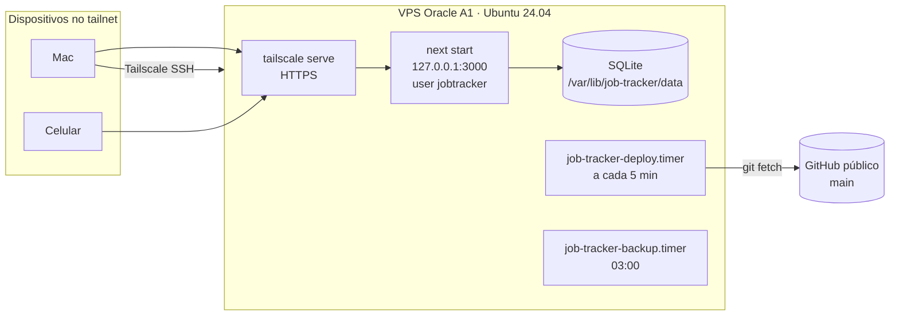

# Deploy e operação (produção)

Produção roda numa VPS própria, acessível só por VPN (Tailscale). Desde 2026-09-25 **a VPS é a fonte da verdade** dos dados; o Mac é só desenvolvimento.

O runbook operacional detalhado é [`deploy/README.md`](../deploy/README.md). Este documento dá o contexto, as decisões e os cuidados.

> **Repositório público.** Nunca commitar: arquivo de env, nome do tailnet ou URL de produção, banco, uploads, backups. Nesta doc eles aparecem como `<TAILNET>`, `<DOMINIO_PESSOAL>` etc.

## Topologia



- **Provedor**: Oracle Cloud "Always Free", VM Ampere A1. A conta foi convertida para Pay As You Go (a A1 dava "Out of capacity" no plano free), com budget de alerta. Rede criada pelo VCN Wizard.
- **Acesso**: Tailscale. SSH via Tailscale SSH (hostname `job-tracker`); porta 22 pública fechada; **nenhuma porta pública** para o app.
- **HTTP**: `tailscale serve` → `127.0.0.1:3000`. URL `https://job-tracker.<TAILNET>.ts.net/`, abre só em dispositivo conectado ao tailnet. **Nunca** usar `tailscale funnel` (exporia o app, que não tem autenticação).
- **SSH do Mac**: `ssh job-tracker` (alias no `~/.ssh/config`, usuário `ubuntu`).

## Layout no servidor

| Caminho | Conteúdo |
|---|---|
| `/srv/job-tracker/repo` | clone usado só para `git fetch` |
| `/srv/job-tracker/releases/<AAAAMMDD-HHMMSS>-<sha7>` | releases compiladas (mantém 3) |
| `/srv/job-tracker/current` | symlink para a release ativa |
| `/srv/job-tracker/.last-failed-sha` | último commit que falhou |
| `/etc/job-tracker/env` | variáveis de ambiente (`640 root:jobtracker`) |
| `/var/lib/job-tracker/data` | SQLite + uploads |
| `/var/lib/job-tracker/backups` | `daily/`, `weekly/`, `monthly/`, `pre-deploy/` (700) |
| `/usr/local/sbin/job-tracker-deploy` | cópia root do `deploy/deploy.sh` |

Antes do primeiro deploy automático o código ficava em `/opt/job-tracker` (removido após a migração).

## Serviços systemd (`deploy/systemd/`)

| Unit | O que faz |
|---|---|
| `job-tracker.service` | `next start -H 127.0.0.1 -p 3000` a partir de `current/`, usuário `jobtracker`, `EnvironmentFile=/etc/job-tracker/env`, `Restart=on-failure`, hardening (`NoNewPrivileges`, `PrivateTmp`, `ProtectSystem=full`, `ProtectHome`) |
| `job-tracker-deploy.service` + `.timer` | roda `job-tracker-deploy` (root) 1 min após ativar, 2 min após boot e 5 min depois de cada execução; timeout 60 min; `Nice=10` |
| `job-tracker-backup.service` + `.timer` | `scripts/backup-db.sh` como `jobtracker`, `BACKUP_DIR=/var/lib/job-tracker/backups`, todo dia 03:00 `America/Sao_Paulo`, `Persistent=true` |

## Deploy pull-based

Decisão (2026-09-25): **sem GitHub Actions**, para não guardar chave do Tailscale/servidor no GitHub. O servidor só lê o repositório público.

[`deploy/deploy.sh`](../deploy/deploy.sh), a cada tick:

1. `flock` em `/run/job-tracker-deploy.lock` (um deploy por vez).
2. `git fetch origin main`. Sai se o SHA é o atual ou o último que falhou (a não ser com `FORCE=1`).
3. **Fail closed no env**: carrega `/etc/job-tracker/env`; se `DATABASE_URL` não for caminho absoluto de arquivo existente → *abort* (sem marcar o commit como falho; corrigido o env, o próximo tick segue).
4. `git archive` do SHA para uma release nova + `.release-sha`.
5. `npm ci` **sem** o env carregado (scripts de instalação não veem segredos), `npx playwright install chromium`, `npm run build` com o env. Falha → apaga a release, marca o SHA como falho, versão atual segue no ar.
6. Espera run do radar terminar (até 30 min) consultando `/api/monitoring/current`. Se não terminar, desiste e tenta no próximo tick.
7. Snapshot do banco em `backups/pre-deploy/` (`sqlite3 .backup` + gzip, mantém 5) e `npx drizzle-kit migrate`.
8. Troca atômica do symlink `current`, `systemctl restart job-tracker`, health check `GET /dashboard` (30 tentativas × 2 s).
9. Health check falhou → volta o symlink para a release anterior, reinicia, marca o SHA como falho.
10. Sucesso → remove o marcador de falha e apaga releases antigas (mantém 3, nunca a ativa).

Segurança do script: tudo que executa código do repositório (npm, build, migrations) roda como `jobtracker` via `runuser`. O script que roda como root só muda quando `install.sh` é executado de novo, então um push na `main` não altera o que roda como root.

Instalação e reinstalação: `sudo bash deploy/install.sh` (idempotente; cria diretórios, clona o repo, instala o script e as units, faz backup `.bak-*` de units alteradas, habilita os timers quando `current` existe). Rode de novo, a partir de `current/`, sempre que `deploy.sh` ou `systemd/*` mudarem.

## Ambiente de produção

`/etc/job-tracker/env` é lido pelo systemd (`EnvironmentFile`) **e** pelo bash no deploy (`set -a; . arquivo`). Por isso:

- formato `CHAVE=valor`, sem espaços; o runbook pede valores sem aspas;
- nada de `<`, `>` ou espaços soltos (o bash interpretaria); um placeholder só é tolerado entre aspas;
- `DATABASE_URL` absoluto (`/var/lib/job-tracker/data/job-tracker.db`);
- `UPLOADS_PATH` apontando para o diretório de uploads dentro de `/var/lib/job-tracker/data` (fora da release, senão os arquivos somem na rotação);
- chaves reais de `OLLAMA_*` e `OPENAI_API_KEY`;
- `GLASSDOOR_IMPORT_TOKEN=<hex de 32 bytes>` (`openssl rand -hex 32`) para a skill `glassdoor-collect` importar via `/api/glassdoor/import`; sem ele as rotas respondem 503 (ver [modulos/glassdoor.md](modulos/glassdoor.md)). Adicionar a linha e reiniciar o serviço é feito à mão pelo usuário (configurado em 2026-09-29). O nome precisa ser exatamente `GLASSDOOR_IMPORT_TOKEN`: com outro nome as rotas respondem 503.

Editar e aplicar: `ssh -t job-tracker 'sudo nano /etc/job-tracker/env'` e depois `ssh -t job-tracker 'sudo systemctl restart job-tracker'` (o systemd só lê o env na partida). O Tailscale SSH pode pedir uma verificação no navegador antes de abrir a sessão. Se o `systemctl` avisar `unit file ... changed on disk`, rode `sudo systemctl daemon-reload` antes do restart (visto em 2026-09-29: a unit em disco, de 2026-09-25, igual à do repo, não tinha sido recarregada).

Em 2026-09-26 as chaves `OLLAMA_BASE_URL`, `OLLAMA_MODEL`, `OLLAMA_API_KEY` e `OPENAI_API_KEY` ainda estavam com placeholder literal: preencher era pendência do usuário. Confirme antes de depurar radar ou perfil em produção.

Futuro: a base URL pública (para links do digest por e-mail) deve vir de variável de ambiente, nunca do código.

## Dependências de sistema

| Dependência | Instalada por | Observação |
|---|---|---|
| Node/npm, git, sqlite3, curl | manual (setup da VM) | usados pelo deploy e pelos scripts |
| Chromium do Playwright | `deploy.sh` (`playwright install chromium`) | libs de sistema: `cd /srv/job-tracker/current && sudo npx playwright install-deps chromium` a cada upgrade do `playwright` |
| `tectonic` | **ninguém** | geração de currículo falha sem ele; instalar manualmente se for usar em produção |
| Tailscale | manual | |

`pdfjs-dist` (texto do PDF) vem como dependência transitiva de `pdf-parse`, que é devDependency. Funciona porque o `npm ci` do deploy instala devDependencies; não rode `npm ci --omit=dev` sem declarar o pacote.

## Operação do dia a dia

```bash
journalctl -u job-tracker -f                    # logs do app (inclui o radar)
journalctl -u job-tracker-deploy -n 100 --no-pager
systemctl list-timers 'job-tracker-*'
sudo /usr/local/sbin/job-tracker-deploy         # deploy manual
sudo FORCE=1 /usr/local/sbin/job-tracker-deploy # redeploy forçado
sudo systemctl start job-tracker-backup         # backup manual
```

Rollback preferido: `git revert` na `main` e deixar o timer publicar. Rollback imediato e restore do banco: ver [`deploy/README.md`](../deploy/README.md#operação).

## Backups

- Diário 03:00 com rotação 7/28/93 dias (script em [banco-de-dados.md](banco-de-dados.md#backup-e-restore)) + snapshot antes de cada migração.
- **Mesmo disco da VM**: protegem contra erro e corrupção, não contra perda da VM.
- Pendente: backup externo com `restic` para outro provedor (Backblaze B2 ou Cloudflare R2).

## Cuidados

- O deploy só espera runs disparados por `/leads` (SSE). Runs iniciados em `/companies` não aparecem em `/api/monitoring/current`; um restart no meio mata o scan. Um run SSE continua `running` mesmo com empresas falhando; um run sem eventos há 15 min vira `stale` e não segura o deploy (ver [problemas-conhecidos.md](problemas-conhecidos.md)).
- **Rollback não desfaz migrations.** Elas rodam antes da troca de versão; se o health check falhar, a release anterior volta sobre o banco já migrado. Migrations precisam ser compatíveis com a versão anterior, e restaurar o snapshot `pre-deploy` é manual.
- Migrations rodam antes da troca de versão. Migration que quebra = commit marcado como falho; o backup `pre-deploy` fica disponível.
- Se `drizzle-kit migrate` sair com exit 1 sem mensagem, compare colunas reais com o SQL pendente (incidente de `__drizzle_migrations` em [banco-de-dados.md](banco-de-dados.md#__drizzle_migrations-dessincronizado-incidente-na-vps)).
- `tmp/logs/` com dados de extração de perfil fica dentro da release e some quando ela é rotacionada.
- Caminhos de arquivo gravados no banco: uploads usam caminho relativo ao `cwd` (a release), currículos gerados usam caminho absoluto. Ao mover dados de lugar, revise essas colunas.

## Próximos passos planejados (decisões de 2026-09-25)

- Scan agendado 3×/dia (09h, 14h, 19h `America/Sao_Paulo`): timer systemd chamando endpoint interno protegido por token.
- Digest diário por e-mail via Resend (proposto 20h), enviado de um subdomínio de `<DOMINIO_PESSOAL>`. DNS no Registro.br; o apex aponta para a Vercel e **não deve ser alterado**.
- Candidaturas continuam com fila de aprovação humana, **sem auto-submit**.
- Backup offsite (restic → B2/R2).

Ver [roadmap-e-decisoes.md](roadmap-e-decisoes.md).
