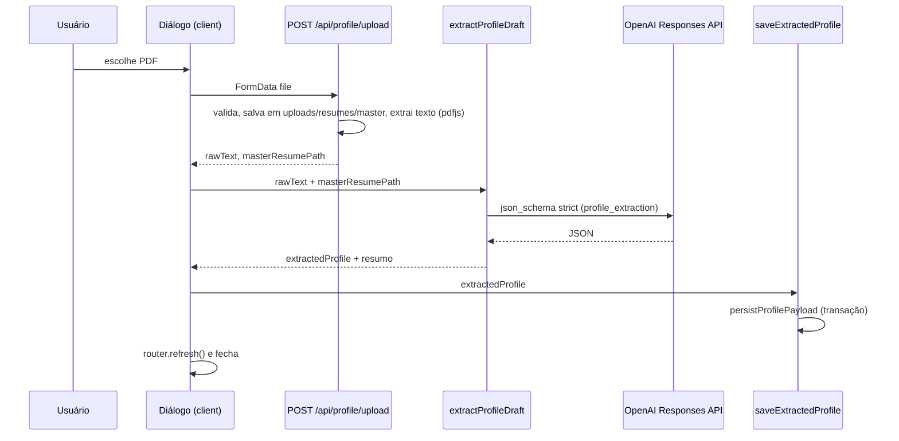

# Módulo: Perfil profissional

Rota `/profile`. Base estruturada sobre o usuário (contatos, preferências, experiências com bullets, skills, projetos, educação). Alimenta a classificação do radar e a geração de currículo.

## Arquivos

| Arquivo | Papel |
|---|---|
| [`src/app/(app)/profile/page.tsx`](../../src/app/(app)/profile/page.tsx) | Server Component (`force-dynamic`), carrega `getProfileSnapshot()` |
| [`src/components/profile/profile-workspace.tsx`](../../src/components/profile/profile-workspace.tsx) | casca da página, estado vazio, botão de upload, editor com `key` |
| [`src/components/profile/profile-upload-panel.tsx`](../../src/components/profile/profile-upload-panel.tsx) | diálogo de upload + extração |
| [`src/components/profile/profile-summary.tsx`](../../src/components/profile/profile-summary.tsx) | **editor em uso** (visualização + edição por seção) |
| [`src/components/profile/profile-review-form.tsx`](../../src/components/profile/profile-review-form.tsx) | formulário antigo, **não importado por ninguém** |
| [`src/app/api/profile/upload/route.ts`](../../src/app/api/profile/upload/route.ts) | `POST` do PDF |
| [`src/server/actions/profile.ts`](../../src/server/actions/profile.ts) | extração, gravação e atualização |
| [`src/lib/profile/upload.ts`](../../src/lib/profile/upload.ts) | salvar PDF e extrair texto |
| [`src/lib/profile/queries.ts`](../../src/lib/profile/queries.ts) | `getProfileSnapshot()` |
| [`src/lib/profile/editor.ts`](../../src/lib/profile/editor.ts) | tipos, opções (modelo, nível, categoria) e fábricas de itens vazios |

## Upload e extração

1. **Upload** (`POST /api/profile/upload`, `runtime = "nodejs"`): exige campo `file`; aceita arquivo não vazio, ≤ 10 MB, (a checagem de extensão/MIME não barra nada: `getPdfExtension` sempre devolve `.pdf`; o arquivo é salvo e só o pdfjs rejeita o que não é PDF). Salva **antes** de extrair em `<UPLOADS_PATH>/resumes/master/master-resume-<timestamp>.pdf`. Texto via `pdfjs-dist/legacy/build/pdf.mjs` (eval desligado, sem worker fetch); PDF sem texto (escaneado) → erro 400.
2. **Extração** (`extractProfileDraft`): **OpenAI** (`extractProfileWithOpenAi`), modelo `OPENAI_COMPARISON_MODEL` (default `gpt-5.4`), `max_output_tokens: 16000`, `json_schema` estrito. `incomplete_details` vira erro. O JSON passa por `parseExtractedProfileResponse` (do módulo Ollama), que tira cercas, valida e normaliza aliases pt/en de enums e datas. Exige `OPENAI_API_KEY`.
3. **Gravação** (`saveExtractedProfile`) com `preserveExistingPreferences: true`: mantém `company_type_preference` e `values_preference` (a extração não produz esses campos), mas sobrescreve contatos, `notes` e `work_model_preference`.

O diálogo mostra três etapas temporizadas (texto → OpenAI → banco).

Não usados hoje: `extractProfile` (rascunho + gravação numa chamada), `extractProfileFromText` (extração via Ollama) e `compareProfileExtraction` (Ollama vs OpenAI). Ver [ia.md](../ia.md).

## Edição

`ProfileSummary` é o editor ativo:

- Seções: básico, links, preferências, experiências, skills, projetos, educação.
- Uma seção editável por vez; os botões "Editar" das outras ficam desabilitados.
- "Editar perfil" abre a seção básica.
- **Salvar e Cancelar valem para o perfil inteiro**: salvar manda o rascunho completo para `updateProfile`; cancelar descarta tudo. O editor remonta com `key = id-updatedAt`.
- No telefone, Salvar/Cancelar ficam numa barra fixa (`md:hidden`, `z-(--z-action-bar)`).
- "Cargo principal" edita `experiences[0].role`; "Sobre você" é `notes`; tags de bullet separadas por vírgula; datas `type=month` gravadas como `YYYY-MM` e exibidas como "mar 2022"; skills agrupadas por categoria.
- Remover o último item de uma lista deixa um item em branco.

## Persistência (`persistProfilePayload`)

- **Um perfil só**: leitura pega o mais recente por `updated_at`; escrita vai no `profileId` pedido ou no mais recente.
- Cada gravação **apaga e reinsere todas as linhas filhas** (experiências, bullets, skills, projetos, educação) numa transação.
- Normalização (`normalizeProfileReviewData`, só no `updateProfile`; o upload usa `validateExtractedProfile`): nome obrigatório; linhas em branco descartadas; experiência precisa de empresa, cargo e início; anos de experiência inteiro ≥ 0; projeto precisa de nome; educação precisa de instituição.
- Enums não são validados na escrita; valor inválido volta como `null` na leitura.
- `stack` de projeto e `tags` de bullet viram JSON em `text`.
- PDFs antigos em `uploads/resumes/master/` nunca são apagados.

## Onde o perfil é usado

| Consumidor | O que usa |
|---|---|
| Classificação do radar | 4 experiências recentes (3 bullets cada), 12 skills, 4 projetos, preferências e notas (`summarizeProfile`) |
| Sinais determinísticos | nomes das skills (stack em comum), `work_model_preference`, senioridade inferida dos 4 cargos recentes |
| Geração de currículo | tudo (experiências com bullets, skills por categoria, projetos, educação, contatos) |
| Dashboard | `work_model_preference` (widget de match) |

Sem perfil, a classificação devolve `review`/40 sem chamar o LLM e a geração de currículo recusa.

## Privacidade

O fluxo grava dados pessoais fora do banco:

- `tmp/logs/profile-extraction-openai-raw-output-*.txt`: saída bruta da OpenAI (o perfil inteiro).
- `tmp/logs/profile-extraction-error-*.json`: em falha, os primeiros 20 000 caracteres do texto do currículo.
- `tmp/` é ignorado pelo git, mas fica no disco (na VPS, dentro do diretório da release). Limpe quando não precisar.

## Armadilhas

- O estado vazio fala em "extração local", mas a extração vai para a OpenAI.
- O aviso de sucesso é setado e o diálogo fecha em seguida, então ele não aparece.
- `profile-review-form.tsx` está morto (e liga `notes` a dois campos).
- `OPENAI_COMPARISON_MODEL=` (definida, vazia) vira modelo `""`: o `??` não cai no default com string vazia.
