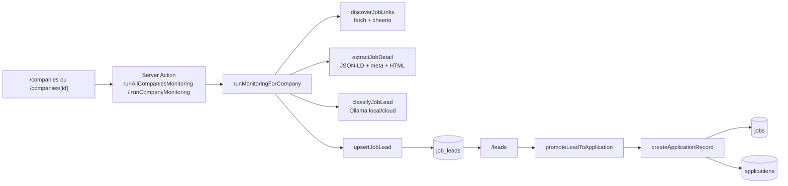
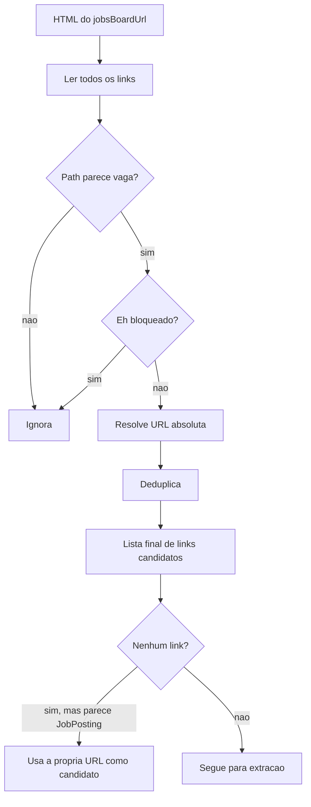
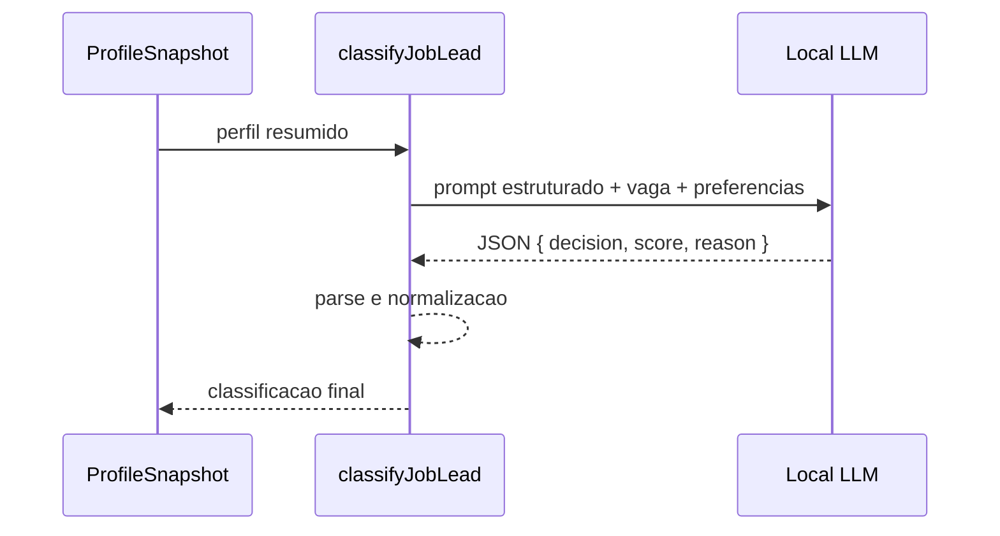
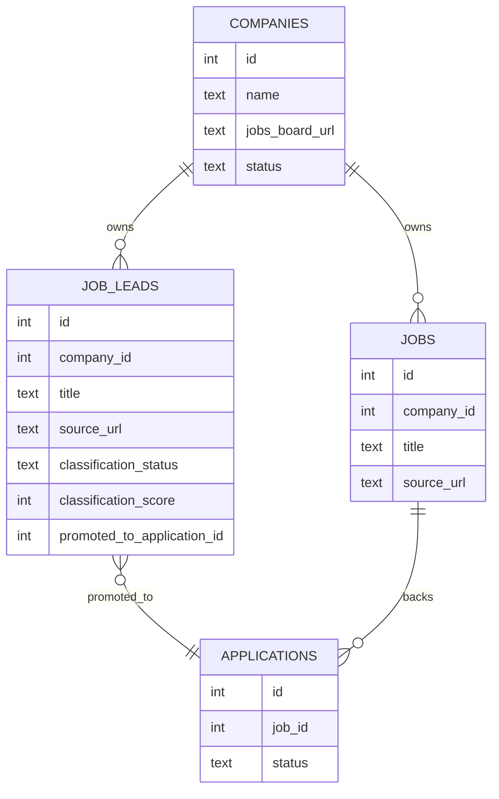
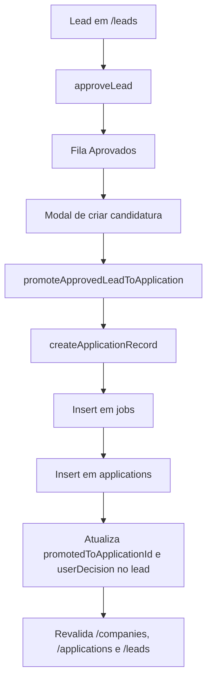

# Radar Manual de Vagas — Implementação

Este documento explica como funciona a implementação do radar manual de vagas que entrou no `job-tracker`.

Os pontos centrais do código são:

- [src/server/actions/job-monitoring.ts](/Users/gabriel_fachini/Desktop/repos/job-tracker/src/server/actions/job-monitoring.ts)
- [src/lib/job-monitoring/index.ts](/Users/gabriel_fachini/Desktop/repos/job-tracker/src/lib/job-monitoring/index.ts)
- [src/lib/job-monitoring/discovery.ts](/Users/gabriel_fachini/Desktop/repos/job-tracker/src/lib/job-monitoring/discovery.ts)
- [src/lib/job-monitoring/extraction.ts](/Users/gabriel_fachini/Desktop/repos/job-tracker/src/lib/job-monitoring/extraction.ts)
- [src/lib/job-monitoring/classification.ts](/Users/gabriel_fachini/Desktop/repos/job-tracker/src/lib/job-monitoring/classification.ts)
- [src/lib/job-monitoring/persistence.ts](/Users/gabriel_fachini/Desktop/repos/job-tracker/src/lib/job-monitoring/persistence.ts)
- [src/app/(app)/leads/page.tsx](/Users/gabriel_fachini/Desktop/repos/job-tracker/src/app/(app)/leads/page.tsx)
- [src/lib/db/schema.ts](/Users/gabriel_fachini/Desktop/repos/job-tracker/src/lib/db/schema.ts)

## Visão Geral

O radar foi implementado como uma pipeline separada de `applications`.

O motivo dessa separação é simples:

- `applications` continua representando relacionamento real com uma vaga já assumida pelo usuário.
- `job_leads` representa oportunidades descobertas automaticamente e ainda não promovidas para o board de candidaturas.

Na prática, o sistema faz isso:

1. Seleciona empresas com `status = monitoring` e `jobsBoardUrl` válido.
2. Acessa o job board com `fetch`.
3. Usa `cheerio` para descobrir links candidatos a vagas.
4. Lê cada vaga e extrai título, descrição e metadados.
5. Usa o perfil salvo do usuário, sinais estruturados em PT-BR e feedback implícito recente para classificar fit com o runtime Ollama configurado.
6. Salva apenas leads `interesting` e `review`.
7. Permite promoção manual do lead para candidatura.

## Arquitetura

## Camadas da Implementação

### 1. Entrada da feature

As entradas principais são os botões de varredura:

- na página de empresas;
- na página de detalhe da empresa;
- e a tela de triagem em `/leads`.

Esses gatilhos chamam as Server Actions em [src/server/actions/job-monitoring.ts](/Users/gabriel_fachini/Desktop/repos/job-tracker/src/server/actions/job-monitoring.ts).

Existem duas ações de execução:

- `runCompanyMonitoring(companyId)`
- `runAllCompaniesMonitoring()`

As duas fazem validação de escopo antes de rodar:

- a empresa precisa existir;
- o status precisa ser `monitoring`;
- `jobsBoardUrl` precisa estar preenchido;
- links que apontem para LinkedIn são excluídos da automação.

### 2. Orquestração da pipeline

O coração do fluxo está em [src/lib/job-monitoring/index.ts](/Users/gabriel_fachini/Desktop/repos/job-tracker/src/lib/job-monitoring/index.ts).

A função `runMonitoringForCompany(...)` orquestra quatro etapas:

1. descoberta de links;
2. extração do detalhe da vaga;
3. classificação;
4. persistência.

Ela também acumula um resumo de execução:

- `linksFound`
- `jobsParsed`
- `leadsSaved`
- `reviewsSaved`
- `discarded`

Esse resumo volta para a UI e é usado como feedback imediato da varredura.

## Descoberta de Links

O arquivo [src/lib/job-monitoring/discovery.ts](/Users/gabriel_fachini/Desktop/repos/job-tracker/src/lib/job-monitoring/discovery.ts) resolve a etapa de descobrir quais links da página parecem ser vagas.

### Estratégia

- faz `fetch` no `jobsBoardUrl`;
- parseia o HTML com `cheerio`;
- percorre todos os `a[href]`;
- resolve links relativos contra a URL base;
- aplica heurísticas para aceitar ou rejeitar o link.

### Heurísticas de aceitação

O link é considerado candidato quando o path ou a URL contém padrões como:

- `job`
- `jobs`
- `career`
- `careers`
- `vaga`
- `vagas`
- `opening`
- `openings`
- `position`
- `positions`

### Heurísticas de rejeição

O link é descartado quando aponta para:

- login;
- termos;
- privacidade;
- `mailto:`;
- `tel:`;
- `javascript:`;
- LinkedIn.

### Fallback importante

Se a página não tiver links detectados, mas o HTML parecer uma vaga única, a implementação usa a própria URL base como candidato.

Isso é útil para páginas que já abrem direto no detalhe da vaga.

## Extração dos Dados da Vaga

O arquivo [src/lib/job-monitoring/extraction.ts](/Users/gabriel_fachini/Desktop/repos/job-tracker/src/lib/job-monitoring/extraction.ts) recebe uma URL de vaga e tenta extrair conteúdo estruturado.

### Ordem de precedência

A extração segue uma ordem deliberada:

1. `application/ld+json` com `JobPosting`
2. `meta` tags, incluindo `og:title`
3. HTML semântico como `h1`, `main`, `article`
4. maior bloco textual relevante encontrado no DOM

Essa ordem existe porque `JobPosting` e `meta` costumam ser mais limpos que texto bruto de DOM.

### Campos extraídos

O retorno é um `ExtractedJobDetail` com:

- `title`
- `description`
- `sourceUrl`
- `sourceName`
- `workModel`
- `seniority`
- `locationText`
- `salaryText`

### Derivações feitas em código

Além do parse literal, a implementação infere:

- `workModel`: remoto, híbrido ou presencial;
- `seniority`: intern, junior, mid, senior, staff, lead.

Essas inferências vêm de padrões simples de texto no título e na descrição.

## Classificação com o Modelo Local

O arquivo [src/lib/job-monitoring/classification.ts](/Users/gabriel_fachini/Desktop/repos/job-tracker/src/lib/job-monitoring/classification.ts) usa `callOllamaLlm(...)` do runtime principal do Ollama já existente.

### Contexto usado

A classificação não olha só para a vaga. Ela injeta:

- resumo do perfil salvo do usuário;
- sinais estruturados em PT-BR extraídos da vaga;
- feedback implícito recente de leads promovidos ou descartados manualmente.

O perfil é carregado por [src/lib/profile/queries.ts](/Users/gabriel_fachini/Desktop/repos/job-tracker/src/lib/profile/queries.ts) e resumido antes de ir para o modelo.

### Contrato da resposta

O modelo deve responder JSON com:

- `decision`
- `score`
- `reason`
- `matchedSignals`
- `riskSignals`
- `missingSignals`

As decisões válidas são:

- `interesting`
- `review`
- `discarded`

### Regras de fallback

Se não existir perfil salvo, o sistema não tenta forçar confiança artificial. Nesse caso ele devolve:

- `decision = review`
- `score = 40`

Se o runtime Ollama falhar, a vaga também cai em `review`, com a falha registrada no motivo.

## Persistência dos Leads

O schema foi expandido em [src/lib/db/schema.ts](/Users/gabriel_fachini/Desktop/repos/job-tracker/src/lib/db/schema.ts) com a tabela `job_leads`.

### Estrutura lógica de `job_leads`

- `companyId`: empresa dona do lead
- `title`: título usado na triagem
- `sourceUrl`: URL original da vaga
- `sourceName`: origem detectada
- `description`: descrição salva localmente
- `workModel`
- `seniority`
- `locationText`
- `salaryText`
- `classificationStatus`
- `classificationScore`
- `classificationReason`
- `userDecision`: `none | approved | promoted | dismissed`
- `userDecisionAt`
- `promotedToApplicationId`
- `discoveredAt`
- `updatedAt`

### Deduplicação

O índice único é:

- `companyId + sourceUrl`

Isso significa que a mesma vaga pode reaparecer em uma nova varredura sem criar duplicata.

Nesse caso, o sistema faz `update` em vez de `insert`.

### Regra importante da v1

Descartes automáticos não são persistidos.

Somente:

- `interesting`
- `review`

viram linhas em `job_leads`.

O código dessa parte está em [src/lib/job-monitoring/persistence.ts](/Users/gabriel_fachini/Desktop/repos/job-tracker/src/lib/job-monitoring/persistence.ts).

## Aprovação e Promoção para Candidatura

O fluxo manual agora foi dividido em duas etapas:

1. o usuário aprova o lead em `/leads`;
2. o lead aprovado vai para a aba `Aprovados`;
3. dali, o usuário abre o modal de criação de candidatura com os dados pré-preenchidos.

### O que ela faz

1. `approveLead(leadId)` marca `userDecision=approved`.
2. O lead sai da aba `Triagem` e passa a aparecer em `Aprovados`.
3. `promoteApprovedLeadToApplication()` recebe o `leadId` e os campos finais do modal.
4. A action reaproveita o helper [src/lib/applications/create-application-record.ts](/Users/gabriel_fachini/Desktop/repos/job-tracker/src/lib/applications/create-application-record.ts).
5. Cria um `job`.
6. Cria uma `application`.
7. Marca `userDecision=promoted` e `promotedToApplicationId` no lead.

### Por que isso importa

Essa escolha evita duplicar lógica entre:

- cadastro manual de candidatura;
- promoção de lead monitorado.

Ela também preserva o shape legado atual do repositório:

- `jobs`
- `applications`

sem tentar resolver agora a divergência histórica da spec sobre “não existir entidade vaga separada”.

## Interface `/leads`

A tela [src/app/(app)/leads/page.tsx](/Users/gabriel_fachini/Desktop/repos/job-tracker/src/app/(app)/leads/page.tsx) é a superfície principal da feature.

Agora ela é organizada em duas abas:

- `Triagem`: leads sem decisão manual;
- `Aprovados`: leads aprovados e ainda não promovidos.

Ela lista:

- título da vaga;
- empresa;
- score;
- motivo da classificação;
- descrição em markdown renderizado;
- origem;
- data;
- estado de triagem.

### Ações disponíveis

- `Abrir vaga`
- `Aprovar lead`
- `Descartar`
- `Criar candidatura` na aba `Aprovados`
- abrir modal deep-linkável com `leadId` para ler a descrição completa

`Descartar` aqui é manual e persistido, diferente do descarte automático da pipeline.

## Revalidação e Atualização de UI

Depois de rodar a varredura, descartar lead ou promover para candidatura, o sistema revalida:

- `/companies`
- `/applications`
- `/leads`

Isso é feito em `revalidateRadarViews()` dentro de [src/server/actions/job-monitoring.ts](/Users/gabriel_fachini/Desktop/repos/job-tracker/src/server/actions/job-monitoring.ts).

## Testes Criados

Entraram testes locais em:

- [src/lib/job-monitoring/discovery.test.ts](/Users/gabriel_fachini/Desktop/repos/job-tracker/src/lib/job-monitoring/discovery.test.ts)
- [src/lib/job-monitoring/extraction.test.ts](/Users/gabriel_fachini/Desktop/repos/job-tracker/src/lib/job-monitoring/extraction.test.ts)
- [src/lib/job-monitoring/classification.test.ts](/Users/gabriel_fachini/Desktop/repos/job-tracker/src/lib/job-monitoring/classification.test.ts)
- [src/lib/job-monitoring/index.test.ts](/Users/gabriel_fachini/Desktop/repos/job-tracker/src/lib/job-monitoring/index.test.ts)

Eles cobrem:

- descoberta de links;
- fallback para página única;
- extração via JSON-LD e HTML;
- normalização da classificação;
- orquestração completa da pipeline.

## Limites Atuais da Implementação

Os limites mais importantes da v1 são:

- não existe scheduler;
- não existe Playwright;
- LinkedIn não entra;
- a descoberta é heurística e pode perder job boards muito dinâmicos;
- a classificação depende da qualidade do perfil salvo, dos sinais extraídos e do runtime Ollama configurado;
- o build local exige que as migrations `0007` e `0008` estejam aplicadas ao SQLite antes da rota `/leads` ficar funcional.

## Resumo Operacional

Se quiser entender a implementação em uma frase:

o radar é uma pipeline server-side que transforma `companies.monitoring + jobsBoardUrl` em `job_leads`, e só depois, por decisão manual do usuário, promove alguns desses leads para `applications`.
