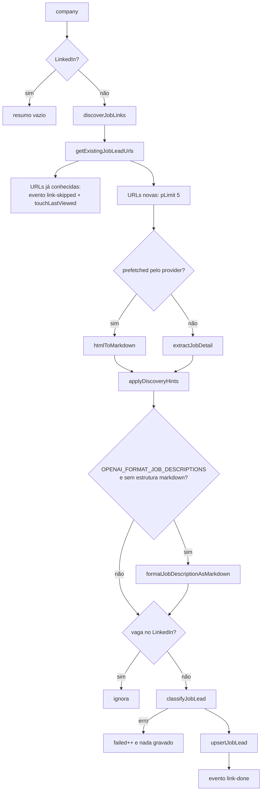

# Radar de vagas (monitoramento de job boards)

O radar varre os job boards das empresas cadastradas, extrai cada vaga, classifica o encaixe com o perfil salvo e grava o resultado em `job_leads`. Nada vira candidatura sozinho: o usuário triagem em `/leads` e promove manualmente (ver [modulos/leads.md](modulos/leads.md)).

Hoje o radar é **disparado manualmente**. Scans agendados (09h, 14h e 19h) estão planejados, não implementados (ver [roadmap-e-decisoes.md](roadmap-e-decisoes.md)).

## Mapa do código

| Arquivo | Papel |
|---|---|
| [`src/server/actions/job-monitoring.ts`](../src/server/actions/job-monitoring.ts) | Server Actions: seleção de empresas, contexto de classificação, execução, aprovação/descarte/promoção de leads |
| [`src/app/api/monitoring/stream/route.ts`](../src/app/api/monitoring/stream/route.ts) | `GET` SSE que roda o radar completo e transmite eventos |
| [`src/app/api/monitoring/current/route.ts`](../src/app/api/monitoring/current/route.ts) | `GET` snapshot do run em andamento |
| [`src/lib/job-monitoring/index.ts`](../src/lib/job-monitoring/index.ts) | `runMonitoringForCompany`: orquestra uma empresa |
| [`src/lib/job-monitoring/bulk-run.ts`](../src/lib/job-monitoring/bulk-run.ts) | `runBulkMonitoring`: roda as empresas em sequência, isola falha por empresa, trata cancelamento e sempre encerra o run |
| [`src/lib/job-monitoring/discovery.ts`](../src/lib/job-monitoring/discovery.ts) | descoberta de links (provider ATS, fetch ou Playwright) |
| [`src/lib/job-monitoring/providers/`](../src/lib/job-monitoring/providers/) | adapters Greenhouse, Gupy e InHire |
| [`src/lib/job-monitoring/extraction.ts`](../src/lib/job-monitoring/extraction.ts) | leitura de uma página de vaga (JSON-LD, meta, HTML) → markdown |
| [`src/lib/job-monitoring/signals.ts`](../src/lib/job-monitoring/signals.ts) | sinais determinísticos (stack, senioridade, modelo, local) |
| [`src/lib/job-monitoring/classification.ts`](../src/lib/job-monitoring/classification.ts) | prompt, schema JSON e parse da classificação via Ollama |
| [`src/lib/job-monitoring/feedback.ts`](../src/lib/job-monitoring/feedback.ts) | exemplos recentes de promoção/descarte injetados no prompt |
| [`src/lib/job-monitoring/persistence.ts`](../src/lib/job-monitoring/persistence.ts) | skip de URLs conhecidas, `last_viewed`, upsert |
| [`src/lib/job-monitoring/run-state.ts`](../src/lib/job-monitoring/run-state.ts) | tracker em memória do run SSE: trava contra run concorrente, progresso, erros por empresa, detecção de run travado |
| [`src/lib/job-monitoring/logger.ts`](../src/lib/job-monitoring/logger.ts) | logs coloridos e relatório final no terminal |
| [`src/lib/job-monitoring/progress-state.ts`](../src/lib/job-monitoring/progress-state.ts) | reducer puro do progresso no cliente (eventos SSE e snapshot) |
| [`src/components/leads/monitoring-progress-context.tsx`](../src/components/leads/monitoring-progress-context.tsx) | cliente SSE (`EventSource`), acompanhamento por snapshot e invalidação do TanStack Query |

## Gatilhos

Existem três jeitos de rodar, com comportamentos diferentes:

| Onde | Chamada | Transporte | Escopo | Aparece em `/api/monitoring/current`? |
|---|---|---|---|---|
| `/leads` (botão "Rodar radar") | `startMonitoring()` → `new EventSource("/api/monitoring/stream")` | SSE | empresas em lote (sem `discarded`/`blacklist`) | **sim** |
| `/companies` | Server Action `runAllCompaniesMonitoring()` | request único, espera acabar | empresas em lote (sem `discarded`/`blacklist`) | não |
| `/companies/[id]` | Server Action `runCompanyMonitoring(companyId)` | request único | uma empresa, qualquer status | não |

Só o caminho SSE passa por `runBulkMonitoring`: usa o `run-state` (e a trava de um run por vez), emite progresso, pode ser cancelado e imprime o relatório final. As Server Actions devolvem um `MonitoringActionResult` (resumo + `success`/`error`) e revalidam `/companies`, `/applications` e `/leads`.

## Quais empresas entram

Varredura em lote (SSE e `runAllCompaniesMonitoring`) usa `getBulkMonitorableCompanies()`: `jobs_board_url` não nulo, `new URL()` válido e status **fora** de `radarSkippedCompanyStatuses` (`discarded`, `blacklist`, em [`src/lib/companies.ts`](../src/lib/companies.ts)). Ou seja, entram `monitoring` e `in_process`. Esse filtro existe desde `cb455cc` (2026-09-27); antes, qualquer status era varrido.

A varredura individual (`runCompanyMonitoring`, botão no detalhe da empresa) **ignora o status**: dá para varrer uma empresa descartada de propósito. Board no LinkedIn é pulado dentro de `runMonitoringForCompany` (`skip-linkedin-source`).

O contexto de classificação é montado **uma vez por execução**:

- `getProfileSnapshot()`: perfil mais recente com experiências, skills, projetos e educação.
- `getRecentLeadFeedbackSummary()`: até 3 leads `promoted` e até 3 `dismissed` cujo `classification_status` atual não é `review` (na prática quase todos, porque `discardLead` já troca o status para `discarded`), formatados como `"<título> em <empresa>: <motivo>"`.

## Pipeline de uma empresa


```mermaid
flowchart TD
    A[company] --> B{LinkedIn?}
    B -- sim --> Z[resumo vazio]
    B -- não --> C[discoverJobLinks]
    C --> D[getExistingJobLeadUrls]
    D --> E[URLs já conhecidas:<br/>evento link-skipped + touchLastViewed]
    D --> F[URLs novas: pLimit 5]
    F --> G{prefetched pelo provider?}
    G -- sim --> H[htmlToMarkdown]
    G -- não --> I[extractJobDetail]
    H --> J[applyDiscoveryHints]
    I --> J
    J --> K{OPENAI_FORMAT_JOB_DESCRIPTIONS<br/>e sem estrutura markdown?}
    K -- sim --> L[formatJobDescriptionAsMarkdown]
    K -- não --> M
    L --> M{vaga no LinkedIn?}
    M -- sim --> Z2[ignora]
    M -- não --> N[classifyJobLead]
    N -- erro --> X[failed++ e nada gravado]
    N --> O[upsertJobLead]
    O --> P[evento link-done]
```

Detalhes de cada etapa:

### 1. Descoberta (`discoverJobLinks`)

1. `resolveAtsProvider(company, company.atsProvider)`: com `auto`, detecta por substring na URL inteira (`url.includes`: `boards.greenhouse.io`/`job-boards.greenhouse.io` → `greenhouse`, `*.gupy.io` → `gupy`, `*.inhire.app` → `inhire`, resto → `generic`). Valor explícito é respeitado.
2. Provider ≠ `generic`: chama o adapter. Se ele lançar erro, loga `provider-discovery-failed` e cai no scraping HTML. Se devolver `null` (ex.: Greenhouse sem token extraível da URL), também cai.
3. Scraping HTML conforme `job_board_navigation_mode`:
   - `fetch`: baixa o board, extrai `a[href]` com heurística e segue paginação (`?page=`, `?pagina=`, `/page/N`, `rel=next`, texto "next/próxima").
   - `browser`: Chromium headless do Playwright (locale `pt-BR`), tenta aceitar banner de cookies, maximiza "itens por página" em `<select>`, lê só links visíveis e clica em "próxima" até não haver mais página ou repetir o conteúdo (fingerprint de URLs + label da página ativa).

Heurística `isLikelyJobUrl` (aceita quando todas as condições passam):

- rejeita `login`, `signin`, `terms`, `privacy`, `policy`, `cookies`, `mailto:`, `tel:`, `javascript:`, links com `#hash`, LinkedIn e a própria URL do board;
- exige palavra de vaga na URL (`job`, `career`, `vaga`, `opening`, `position`, `opportunit`…);
- path genérico (`/jobs`, `/vagas`…) só passa com sinal de detalhe;
- link de outra origem só passa com sinal de detalhe: path `/<jobs|vagas|…>/<algo>`, query `gh_jid`/`jobId`/`openingId`/`vacancyId`, ou texto do link com 2+ palavras que não seja genérico ("ver vagas", "saiba mais"…).

Sem nenhum link, se o HTML tiver `application/ld+json` ou `"@type":"JobPosting"`, a própria URL vira candidata (página de vaga única). Esse fallback só existe no modo `fetch`; o modo `browser` não tem.

### 2. Providers ATS

Todos devolvem `DiscoveredLink[]` e, quando conseguem, `prefetched` (título + HTML da descrição), o que evita baixar a página de cada vaga. Detalhes em paralelo com `pLimit(5)`. Falha no detalhe de uma vaga devolve só `{ url, text }`, e a extração HTML assume.

| Provider | Listagem | Detalhe | Observações |
|---|---|---|---|
| Greenhouse ([`greenhouse.ts`](../src/lib/job-monitoring/providers/greenhouse.ts)) | `GET boards-api.greenhouse.io/v1/boards/<token>/jobs` | `…/jobs/<id>` | token = 1º segmento do path da URL do board. 404 → erro "token inválido". `content` vem com entidades HTML; é decodificado antes do Turndown. Local = `location` + `offices`. |
| Gupy ([`gupy.ts`](../src/lib/job-monitoring/providers/gupy.ts)) | HTML de `https://<slug>.gupy.io/`, lendo `__NEXT_DATA__` | `…/jobs/<id>?jobBoardSource=gupy_public_page` (`__NEXT_DATA__`) | descarta vagas com `status ≠ published`. Descrição = `description` + `responsibilities` + `prerequisites`. Board fora do ar → lista vazia (não lança). |
| InHire ([`inhire.ts`](../src/lib/job-monitoring/providers/inhire.ts)) | `GET api.inhire.app/job-posts/public/pages` com header `X-Tenant: <slug>` | `…/pages/<jobId>` | filtra `status === "published"`. URL pública: `https://<slug>.inhire.app/vagas/<jobId>`. |

`companies.ats_board_token` não tem campo na UI (a criação grava `null` e a edição preserva o valor existente); ele só é repassado ao radar, e nenhum adapter o lê.

Listagem do Gupy ou do InHire fora do ar devolve lista vazia em vez de lançar: não há fallback para HTML, e o log mostra `provider-discovery-success` com 0 links, igual a um board sem vagas.

### 3. Skip de URLs conhecidas

Antes de processar, `getExistingJobLeadUrls(companyId, urls)` busca o que já existe em `job_leads` (qualquer status, inclusive `discarded`). Essas URLs:

- não são reextraídas nem reclassificadas;
- emitem `link-skipped`;
- têm `last_viewed` atualizado (`touchLastViewed`).

Consequência: mudar o perfil **não** reclassifica leads antigos. Uma vaga só volta a ser avaliada se sumir do banco.

### 4. Extração (`extractJobDetail`)

Para links sem `prefetched`: `fetch` com user-agent `JobTrackerRadar/1.0`, `Accept-Language: pt-BR`, `cache: "no-store"`. Status HTTP não-2xx lança erro (conta como `failed`).

Precedência:

1. **Título**: JSON-LD `JobPosting.title` → `h1` → `og:title` → `<title>`.
2. **Descrição**: JSON-LD `description` (HTML → markdown via Turndown) → primeiro seletor com ≥ 120 caracteres entre `[itemprop=description]`, `main`, `article`, `[role=main]`, `.job-description`, `.jobDescriptionContent`, `.description` → maior `section`/`div` legível (filtra blocos com muita pontuação de CSS).
3. **Local**: `jobLocation.address` (cidade, região, país) → `og:locality`. **Salário**: `baseSalary.value` (`min`/`max`/`currency`, default BRL).
4. Limpeza: corta tudo antes de "Descrição da vaga"/"Job description" se o marcador aparecer nos primeiros 400 caracteres, remove o título repetido no início e parágrafos finais de ruído ("Compartilhar vaga", "Candidatar-se", redes sociais, URL solta…).
5. `workModel`: só preenche se exatamente um entre remoto/híbrido/presencial aparecer no texto normalizado. `seniority`: primeiro padrão encontrado na ordem estágio → júnior → pleno → sênior → staff → lead.
6. `sourceName`: `linkedin`, `gupy`, `inhire` ou `company_site` (Greenhouse cai em `company_site`).

Depois, `applyDiscoveryHints` usa o **texto do link** para sobrescrever `workModel` e `seniority` quando ele traz a informação (ex.: "Engenheiro Sênior (Remoto)").

Vagas vindas de provider não passam pela detecção de `workModel`/`seniority` do HTML; só pelos hints do título.

### 5. Formatação opcional da descrição

Com `OPENAI_FORMAT_JOB_DESCRIPTIONS=true`, descrições **sem** estrutura markdown (sem parágrafo duplo, cabeçalho `#`, lista ou `**`) vão para `formatJobDescriptionAsMarkdown` (OpenAI `gpt-4o-mini`, até 4000 tokens de saída). Erro é logado (`description-format-failed`) e a descrição original segue.

### 6. Sinais determinísticos

[`signals.ts`](../src/lib/job-monitoring/signals.ts) normaliza o texto (sem acentos, minúsculo) e detecta:

- `detectedSeniority`, `detectedWorkModels`, `employmentTypes` (`clt`, `pj`, `contractor`, `internship`, `part_time`, `full_time`);
- `locationSignals` (capitais/grandes cidades e siglas de UF);
- `jobFamily` (`engineering`, `data`, `product`, `sales`, `marketing`);
- `stackSignals` (25 tecnologias: Node.js, TypeScript, React, Next.js, Python, Java, Go, AWS, PostgreSQL, Docker, Kubernetes…);
- `positiveSignals` e `blockedSignals` (estágio, vendas).

`buildSignalAssessment` cruza com o perfil e gera `matchedSignals`, `riskSignals` e `missingSignals`: stack em comum com as skills, modelo de trabalho compatível com a preferência, senioridade da vaga abaixo da inferida pelos 4 cargos mais recentes, família de vendas sem stack em comum.

### 7. Classificação (`classifyJobLead`)

- **Sem perfil salvo**: não chama o LLM. Retorna `review`, score `40`, motivo "Perfil principal ainda nao foi configurado…".
- **Com perfil**: `callOllamaLlm` com
  - system prompt em pt-BR que pede só JSON, proíbe inventar e **prefere `review` a `discarded`** na dúvida;
  - prompt = JSON com `companyName`, perfil resumido (4 experiências com 3 bullets, 12 skills, 4 projetos, preferências, notas), a vaga, os sinais extraídos, a avaliação determinística, o feedback recente e os critérios;
  - `format` = JSON Schema (`decision` ∈ `interesting|review|discarded`, `score` 0–100, `reason`, `matchedSignals`, `riskSignals`, `missingSignals`);
  - `temperature: 0`, `think: false`.
- **Parse** (`parseClassificationResponse`): aceita cercas ```` ```json ````, recorta do primeiro `{` ao último `}`, decisão inválida vira `review`, score é arredondado e limitado a 0–100 (ausente → 50), motivo vazio → texto padrão, arrays inválidos caem nos sinais determinísticos.
- **Erro** (timeout, HTTP, JSON inválido): lança `JobLeadClassificationError`. O pipeline registra `classification-failed`, soma em `failed` e **não grava** o lead. Como a URL não entra no banco, ela é tentada de novo na próxima varredura.
- Modo `local`: descarrega o modelo após cada chamada (`unloadOllamaModelIfLocal`).

Os três arrays de sinais só existem em memória (nem o log `classification-finished` os inclui); o banco guarda `decision`, `score` e `reason`.

### 8. Persistência (`upsertJobLead`)

Chave: `(company_id, source_url)`.

- **Novo**: insere com `user_decision = none`, `discovered_at = last_viewed = updated_at = agora`.
- **Existente** (corrida rara, já que URLs conhecidas são puladas): atualiza campos da vaga e da classificação, `last_viewed` e `updated_at`. Mantém `user_decision` e `promoted_to_application_id`.

Grava **todas** as decisões, inclusive `discarded`. Devolve `leadSnapshot` (`LeadListItem`, via `mapRawLeadToListItem`) para o evento SSE.

### Contadores do resumo (`MonitoringSummary`)

| Campo | Significado |
|---|---|
| `linksFound` | links descobertos (antes do skip) |
| `skippedLinks` | já existentes em `job_leads` |
| `jobsParsed` | leads gravados que **não** foram descartados (igual a `leadsSaved` na implementação atual) |
| `leadsSaved` | `interesting` + `review` gravados |
| `reviewsSaved` | só `review` |
| `discarded` | classificados como `discarded` (gravados) |
| `failed` | erro de extração ou de classificação |

Extração vazia (sem título nem descrição) e vagas do LinkedIn não entram em nenhum contador.

## Streaming (SSE)

`GET /api/monitoring/stream` ([`route.ts`](../src/app/api/monitoring/stream/route.ts), `runtime = "nodejs"`, `dynamic = "force-dynamic"`) cria um `ReadableStream`, chama `runAllCompaniesMonitoringStream(sendEvent, { signal })` e escreve cada evento como `data: <json>\n\n`. Cabeçalhos: `Content-Type: text/event-stream`, `Cache-Control: no-cache`, `Connection: keep-alive`, `Access-Control-Allow-Origin: *`.

- **Um run por vez.** Se já houver um run ativo, o GET recebe um único evento `error` com `fatal: true` e `reason: "already-running"` e o stream fecha. O run existente não é tocado.
- **Desconexão cancela.** Fechar o `EventSource` (botão Cancelar, fechar ou recarregar a aba) aciona `request.signal` e o `cancel()` do stream. O run para no próximo ponto de checagem: links que ainda não começaram são pulados, a empresa seguinte não inicia, e o run termina como `cancelled` (sem `all-done`). Links já em andamento (até 5) terminam e podem gravar leads.
- **`sendEvent` nunca lança.** Depois que o cliente sai, os eventos são descartados; um `enqueue` que falha também conta como desconexão.

Eventos (`MonitoringStreamEvent`, em [`types.ts`](../src/lib/job-monitoring/types.ts)):

| `type` | Payload | Quando |
|---|---|---|
| `start` | `total` | início, com o número de empresas |
| `company-start` | `company`, `index`, `total` | antes de cada empresa |
| `link-skipped` | `url`, `companyId` | URL já conhecida |
| `link-processing` | `company`, `title`, `processed`, `total` | ao terminar cada link novo (sucesso ou falha) |
| `link-done` | `company`, `title`, `decision`, `processed`, `total`, `lead?` | após gravar; `lead` só vem quando não é `discarded` |
| `company-done` | `company`, `summary` | fim da empresa |
| `all-done` | `summary` (somado) | fim normal do run |
| `error` | `message`, `company?`, `fatal?`, `reason?` | `company` + `fatal: false`: uma empresa falhou e o run **continua**. `fatal: true`: o run falhou (`Falha ao rodar o radar: …`) ou foi recusado (`reason: "already-running"`) |

Os campos `company`, `fatal` e `reason` são aditivos: um consumidor antigo que só lê `message` continua funcionando.

Depois do stream, a rota revalida `/companies` e `/applications`. `/leads` fica de fora de propósito: o cliente atualiza a lista pelo TanStack Query, e revalidar a página dispararia o fallback do Suspense.

### Orquestração (`runBulkMonitoring`)

[`bulk-run.ts`](../src/lib/job-monitoring/bulk-run.ts), chamado pela Server Action com as empresas do lote, o carregamento do contexto e `runMonitoringForCompany` injetados (por isso os testes não precisam de banco):

1. Tenta reservar o run no tracker; se já houver um ativo, emite o `error` de recusa e sai.
2. Emite `start`; com empresas, carrega perfil e feedback **depois** de reservar (se isso falhar, o run termina como `failed` em vez de ficar preso em `running`).
3. Para cada empresa, em sequência: `company-start` → `runMonitoringForCompany(..., { onEvent, signal })` → `company-done`. Se a empresa lançar, emite `error` com `company` e `fatal: false` e passa para a próxima.
4. Imprime o relatório (também num run cancelado, com o que deu tempo) e emite `all-done`, exceto se cancelado.
5. Em `finally`, sempre chama `finishRun` com o desfecho (`completed`, `cancelled` ou `failed`).

Todo evento emitido passa antes pelo tracker (`recordEvent`), então o snapshot acompanha o stream.

### Cliente

[`monitoring-progress-context.tsx`](../src/components/leads/monitoring-progress-context.tsx), montado no layout `(app)` para o progresso sobreviver à navegação, com o reducer puro em [`progress-state.ts`](../src/lib/job-monitoring/progress-state.ts):

- `startMonitoring()` fecha um `EventSource` anterior e abre outro.
- Cada `link-done` com decisão ≠ `discarded` chama `queryClient.invalidateQueries({ queryKey: ["leads"] })`. O campo `lead` do evento é ignorado: a lista é atualizada por refetch (`getLeads`).
- Um `error` de empresa entra no log e **não** para o cliente: o botão continua desabilitado até o `all-done`.
- Contadores ao vivo seguem a mesma conta do servidor: "salvos" = `interesting` + `review`; "falhas" soma o `failed` de cada `company-done`.
- `all-done` encerra com resultado de sucesso (painel "Radar concluído"); um `error` fatal que não seja recusa marca "Radar falhou".
- Stream que termina sem `all-done` (erro fatal, recusa, queda de conexão): o cliente fecha o `EventSource` e pergunta ao servidor (`GET /api/monitoring/current`). Isso também evita a reconexão automática do navegador, que dispararia outro scan.
- **Acompanhando sem stream.** Se o servidor diz que há run ativo (ao montar a página, depois de uma recusa ou de uma queda), a aba mostra o snapshot e relê `/api/monitoring/current` a cada 3 s até o run acabar; então invalida `["leads"]`. Nesse modo não há botão Cancelar (o run pertence a outra conexão). Os números do resumo final são os da última leitura.
- **Cancelar** fecha o `EventSource`, o que cancela o run no servidor. A aba volta ao estado parado na hora; leads gravados pelos links que ainda estavam em andamento aparecem no próximo refetch.

Quem consome o contexto: o painel de progresso em `/leads` ([`monitoring-progress-display.tsx`](../src/components/leads/monitoring-progress-display.tsx): barra, últimas 3 linhas do log, contadores), o indicador no rodapé da sidebar, um ponto pulsante na aba Leads da navegação mobile e os botões de radar das páginas de empresa (desabilitados enquanto houver run SSE).

## Estado do run (`run-state.ts`)

`createRunTracker()` cria o tracker; o do processo (`runTracker`) fica em `globalThis`, compartilhado pela rota do stream e pela do snapshot (e preservado no HMR do dev). Só o caminho SSE o usa.

- `tryStartRun(id, totalCompanies)`: recusa (`{ ok: false, activeRun }`) se houver run ativo, ou seja, `running` e não travado.
- `recordEvent(runId, event)`: atualiza empresa atual, progresso **da empresa atual** (`linksProcessed`/`linksTotal`, zerados a cada `company-start`), `stats` a cada `link-done` (`saved` = interesting + review, `review`, `discarded`) e `failed` a cada `company-done`, e acumula `companyErrors`. Um `error` **nunca** muda o status.
- `finishRun(runId, desfecho, erro?)`: grava o desfecho e limpa o estado.
- Chamadas com o `runId` de um run que já foi substituído não fazem nada.
- **Run travado**: sem nenhum evento há `RUN_STALE_AFTER_MS` (15 min), o run deixa de bloquear novos runs e o snapshot passa a dizer `stale`. Um run saudável emite eventos a cada poucos segundos; os passos mais longos sem evento (descoberta em browser, timeout do Ollama) ficam bem abaixo disso.

`GET /api/monitoring/current` (`force-dynamic`, `Cache-Control: no-store`) devolve `MonitoringRunSnapshot`:

- `{ status: "idle", run: null }` — nenhum run (os desfechos `completed`/`failed`/`cancelled` não ficam visíveis: o estado é limpo na hora);
- `{ status: "running" | "stale", run: { id, startedAt, endedAt, currentCompany, companyIndex, totalCompanies, linksProcessed, linksTotal, stats: { saved, review, discarded, failed }, companyErrors: [{ company, message, at }], eventCount, lastUpdatedAt } }`.

Uso operacional: o `deploy.sh` da VPS espera (até 30 min) enquanto o corpo tiver `"status":"running"`. Como um erro de empresa não muda mais o status, o deploy espera o run inteiro; um run `stale` não segura o deploy.

Limitações que continuam (detalhes em [problemas-conhecidos.md](problemas-conhecidos.md)):

- Runs disparados por `/companies` ou `/companies/[id]` não passam pelo tracker: não aparecem no snapshot, não são barrados pela trava e o deploy não espera por eles.
- Fechar ou recarregar a aba cancela o run (inclusive quando o celular suspende a aba).
- O estado some em restart do processo e assume um único processo Node.

## Limites e timeouts

| Constante | Valor | Onde |
|---|---|---|
| `LINK_PROCESSING_CONCURRENCY` | 5 | `index.ts` |
| `DETAIL_CONCURRENCY` (providers) | 5 | `providers/*.ts` |
| `MAX_DISCOVERED_LINKS` | 500 | `discovery.ts` |
| `MAX_PAGINATION_PAGES` | 20 | `discovery.ts` |
| Playwright `goto` | 45 s (`domcontentloaded`) | `discovery.ts` |
| `networkidle` | 5 s (fallback: espera 1,2 s) | `discovery.ts` |
| clique em "próxima" | 3 s; espera links mudarem até 12 s (fallback 8 s) | `discovery.ts` |
| Ollama por chamada | `OLLAMA_TIMEOUT_MS` (default 240 s) | `lib/ai/ollama.ts` |
| `RUN_STALE_AFTER_MS` | 15 min sem evento → run `stale` | `run-state.ts` |
| `SNAPSHOT_POLL_INTERVAL_MS` | 3 s (aba acompanhando sem stream) | `monitoring-progress-context.tsx` |

Referência de desempenho registrada em 2026-05: ~2 s por link; 50 links caíram de ~100 s (sequencial) para ~20 s com `pLimit(5)`.

Empresas são processadas **em sequência**; só os links de uma empresa rodam em paralelo.

## Logs

O radar escreve no stdout do servidor. Os passos do pipeline usam `[job-monitoring] [<empresa>] <passo>` com cores (`picocolors`: erros em vermelho, `finished` em verde, durações > 1 s amarelas e > 3 s vermelhas); os passos de descoberta usam o mesmo prefixo sem cor; Gupy e InHire logam como `[gupy]`/`[inhire]` sem a empresa; a orquestração usa `[job-monitoring] [action] run-all-stream-*` (`start`, `company-start|finished|failed`, `rejected`, `cancelled`, `failed`, `finished`). Passos úteis para depurar:

`start-company-run`, `fetch-page`, `fetch-page-result`, `browser-page-result`, `provider-discovery-success|failed`, `discovery-finished`, `skip-filter-applied`, `processing-link`, `extract-prefetched`, `extract-failed`, `extract-empty`, `job-extracted`, `description-formatted`, `classification-finished|failed`, `lead-persisted`, `lead-discarded`, `company-run-finished`.

No fim de um run SSE, `printRadarReport` imprime uma tabela por empresa (links, parsed, salvos, revisar, descartados, falhas, tempo). Na VPS: `journalctl -u job-tracker -f`.

## Testes

```bash
npm run test:job-monitoring
```

Cobrem descoberta (links relativos, dedup, página única, LinkedIn, landing page cross-origin, paginação em browser simulado), extração (JSON-LD, HTML semântico, entidades), classificação (sem perfil, payload inválido, JSON cercado), sinais, orquestração por empresa (incluindo abort), o ciclo de vida do run em lote (`bulk-run.test.ts`: falha de empresa não encerra, recusa de run concorrente, cancelamento, consumidor que lança, contexto que falha), o tracker (`run-state.test.ts`: trava, `stale`, eventos de run substituído) e o reducer do cliente (`progress-state.test.ts`). Estado atual da suíte em [testes-e-qualidade.md](testes-e-qualidade.md).

`runMonitoringForCompany` aceita dependências injetáveis (`discoverJobLinksFn`, `extractJobDetailFn`, `classifyJobLeadFn`, `upsertJobLeadFn`, `onEvent`, `signal`). `runBulkMonitoring` recebe `runCompany`, `loadContext`, `tracker`, `signal` e `report`, e não importa nada do banco. `getExistingJobLeadUrls` e `touchLastViewed` não são injetáveis e tocam o banco de `DATABASE_URL`.

## Como adicionar um provider ATS

1. Crie `src/lib/job-monitoring/providers/<nome>.ts` exportando `fetch<Nome>Jobs(boardUrl): Promise<DiscoveredLink[]>`. Preencha `prefetched` sempre que a API entregar título e descrição.
2. Em [`providers/index.ts`](../src/lib/job-monitoring/providers/index.ts): adicione o valor em `AtsProvider`, a detecção por host em `resolveAtsProvider` e o ramo em `discoverViaProvider`.
3. Adicione a opção no formulário de empresa ([`company-form.tsx`](../src/components/companies/company-form.tsx)).
4. Se quiser `sourceName` próprio, atualize `detectSourceName` ([`extraction.ts`](../src/lib/job-monitoring/extraction.ts)) e `sourceNameOptions` ([`src/lib/jobs.ts`](../src/lib/jobs.ts)). Sem isso, o `<select>` de origem do modal de promoção não tem a opção e provavelmente cai na primeira da lista (`linkedin`); o fallback `company_site` do servidor só vale para valor inválido.
5. Escreva teste com `fetchImpl` falso (os providers Gupy e InHire usam o `fetch` global; injetar exige ajuste).

## Limitações atuais

- Descoberta heurística: boards muito dinâmicos podem exigir modo `browser` ou falhar em silêncio (0 links).
- LinkedIn é ignorado por decisão.
- Leads nunca são reclassificados automaticamente.
- Sem agendamento e sem fila. Cancelar só existe por desconexão do stream SSE; runs de `/companies` não podem ser cancelados.
- Modo `browser` precisa do Chromium do Playwright (`npx playwright install chromium`; na VPS também `install-deps`).
