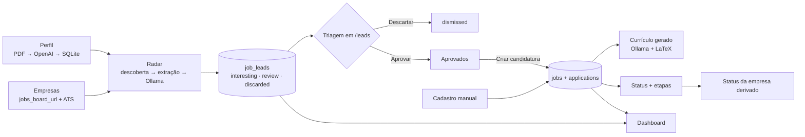

# Visão geral

Job Tracker é uma central pessoal de busca de emprego: um único usuário (o desenvolvedor) mantém o perfil profissional, cadastra empresas de interesse, deixa um radar varrer os job boards delas, triagem os leads que a IA classificou e acompanha as candidaturas até o fim. A pergunta que o produto quer responder: **onde meu processo está funcionando e onde está quebrando?**

Contexto de produto e princípios de design: [`PRODUCT.md`](../PRODUCT.md). Especificação original (histórica): [`.specs/spec.md`](../.specs/spec.md).

## O que existe hoje

| Área | Rota | Resumo | Doc |
|---|---|---|---|
| Dashboard | `/dashboard` | KPIs, backlog, funil, distribuição de classificação, match de preferências, qualidade do classificador, top empresas, atividade do radar | [modulos/dashboard.md](modulos/dashboard.md) |
| Perfil | `/profile` | upload do currículo PDF → extração com IA → edição por seção | [modulos/perfil.md](modulos/perfil.md) |
| Empresas | `/companies` | cadastro, URL do job board, provider ATS, status, logos | [modulos/empresas.md](modulos/empresas.md) |
| Radar | (em `/leads` e `/companies`) | varredura dos boards, extração, classificação com IA | [radar-manual-de-vagas-implementacao.md](radar-manual-de-vagas-implementacao.md) |
| Leads | `/leads` | triagem: aprovar, descartar, promover para candidatura | [modulos/leads.md](modulos/leads.md) |
| Candidaturas | `/applications` | status, etapas, notas, currículo usado e gerado | [modulos/candidaturas.md](modulos/candidaturas.md) |
| Currículo | (na candidatura) | currículo personalizado por vaga via IA + LaTeX | [modulos/curriculo.md](modulos/curriculo.md) |

Roda localmente no Mac (dev) e numa VPS privada acessível por Tailscale (produção, fonte da verdade dos dados desde 2026-09-25).

## Fluxo ponta a ponta

## Glossário

| Termo | Significado | Onde no código |
|---|---|---|
| **Empresa** | organização de interesse; tem status próprio e, opcionalmente, URL de job board | `companies` |
| **Job board** | página de vagas da empresa (site próprio ou ATS) | `companies.jobs_board_url` |
| **Provider ATS** | adapter para plataformas com API/SSR conhecida: Greenhouse, Gupy, InHire | `src/lib/job-monitoring/providers/` |
| **Modo de navegação** | `fetch` (HTML estático) ou `browser` (Chromium via Playwright) | `companies.job_board_navigation_mode` |
| **Radar / varredura / run** | execução do monitoramento sobre uma ou todas as empresas | `runMonitoringForCompany` |
| **Lead** | vaga descoberta pelo radar, ainda não assumida | `job_leads` |
| **Classificação** | veredito da IA: `interesting` (Interessante), `review` (Revisar), `discarded` (Descartada), com score 0–100 e motivo | `classification_*` |
| **Decisão do usuário** | `none`, `approved` (fila Aprovados), `promoted` (virou candidatura), `dismissed` (descartado à mão) | `job_leads.user_decision` |
| **Triagem** | aba de leads sem decisão | `/leads?tab=triage` |
| **Job** | a vaga assumida (título, descrição, modelo, senioridade, origem) | `jobs` |
| **Candidatura** | relação do usuário com um job: status, etapas, notas, currículos | `applications` |
| **Etapa** | marco manual do processo seletivo (ex.: "Entrevista técnica") | `application_stages` |
| **Currículo master** | PDF enviado no perfil, origem da extração | `profile.master_resume_path` |
| **Currículo usado** | PDF enviado de fato para uma candidatura | `applications.used_resume_*` |
| **Currículo gerado** | PDF personalizado criado pela IA para a vaga | `applications.generated_resume_path` |

## Escopo e não-objetivos

- Single-user, sem autenticação, sem multi-tenant, sem sync em nuvem.
- Radar disparado manualmente (agendamento planejado).
- LinkedIn fora do radar por decisão.
- Nada é enviado a empresas automaticamente: candidaturas passam sempre pelo usuário.

## Stack

| Camada | Tecnologia |
|---|---|
| Framework | Next.js 16 (App Router, Server Actions, Turbopack), React 19, TypeScript 6 |
| UI | Tailwind CSS 4, shadcn/ui (`base-nova`) sobre Base UI, Lucide, sonner, Recharts |
| Estado cliente | TanStack Query 5 (leads), URL search params |
| Banco | SQLite via `better-sqlite3` + Drizzle ORM / drizzle-kit |
| Scraping | `fetch` + cheerio, Playwright (Chromium), Turndown (HTML → markdown) |
| IA | Ollama (local/cloud), OpenAI (Responses API) |
| Documentos | pdfjs-dist (texto do PDF), Mustache + LaTeX + tectonic (currículo), react-markdown + remark-gfm |
| Infra | VPS Oracle A1, Tailscale, systemd, deploy pull-based |
| Testes | `node:test` + tsx |

## Por onde começar

1. [arquitetura.md](arquitetura.md) para o desenho geral.
2. [desenvolvimento-local.md](desenvolvimento-local.md) para rodar.
3. [banco-de-dados.md](banco-de-dados.md) e [radar-manual-de-vagas-implementacao.md](radar-manual-de-vagas-implementacao.md) para o núcleo.
4. [problemas-conhecidos.md](problemas-conhecidos.md) antes de mexer em radar, migrations ou dashboard.
