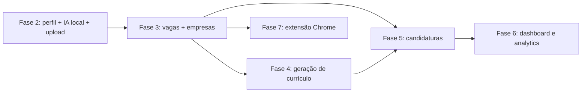
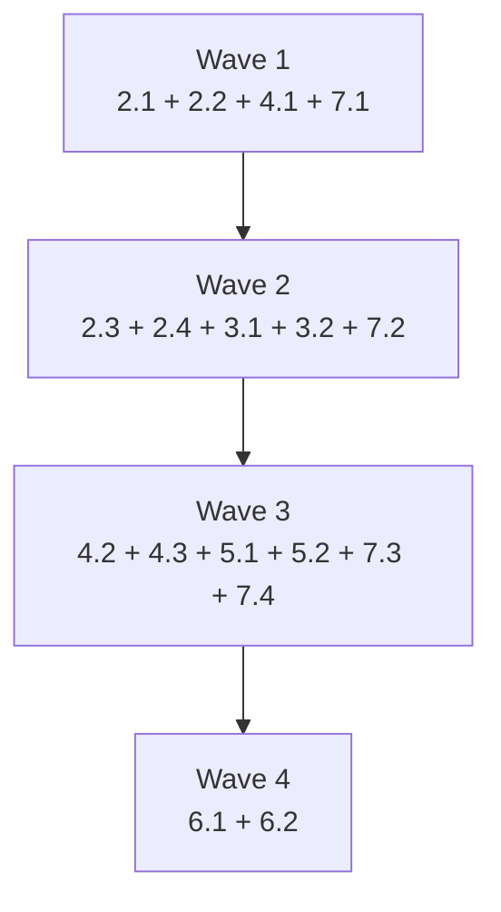
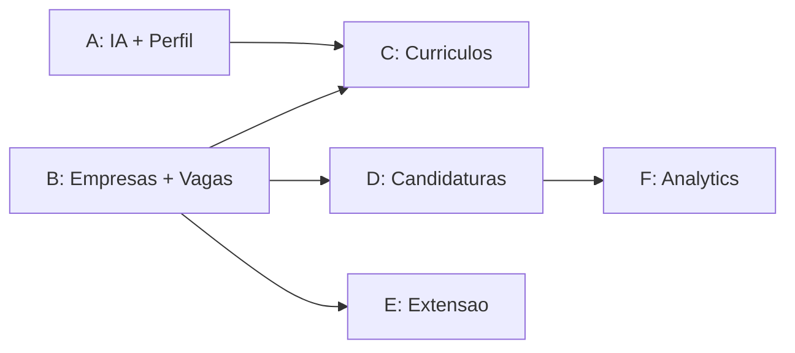

# Paralelization Guide

## Objetivo

Este guia mostra como paralelizar a implementação do `job-tracker` sem criar branches que colidem o tempo todo.

O foco aqui é:

- identificar o caminho crítico;
- separar o que pode rodar em paralelo de verdade;
- evitar disputa sobre contratos compartilhados;
- reduzir merge conflict em arquivos centrais.

## Leitura rápida

- A `Fase 1` já está pronta.
- O shell do app já existe para `dashboard`, `profile`, `companies`, `jobs`, `applications` e `resumes`.
- O maior gargalo agora não é rota. É contrato compartilhado entre `IA local`, `uploads`, `Server Actions` e `persistência`.
- A melhor paralelização aqui é por `domínio com fronteira clara`, não por tela isolada.

## Divergência atual do repositório

O código atual ainda está parcialmente atrás das specs:

- algumas páginas placeholder ainda mencionam a direção antiga de IA;
- as rotas existem, mas os fluxos reais das fases 2 a 7 ainda não foram implementados;
- isso significa que o shell está pronto, mas os contratos de domínio ainda não.

Não trate a existência das páginas como sinal de que o módulo já pode ser dividido sem coordenação.

## Regra central

Paralelize assim:

1. primeiro feche os contratos compartilhados;
2. depois distribua implementação por módulo;
3. só deixe duas frentes tocarem o mesmo contrato se uma delas for dona explícita do arquivo.

## Caminho crítico

## Dependências reais

### Bloqueios fortes

- `Fase 2` bloqueia `Fase 4`, porque geração de currículo depende de perfil estruturado.
- `Fase 3` bloqueia `Fase 4`, `Fase 5`, `Fase 6` e parte da `Fase 7`, porque vaga e empresa viram base de quase tudo.
- `Fase 5` bloqueia parte da `Fase 6`, porque métricas de funil dependem de candidaturas e histórico de status.

### Bloqueios parciais

- `Fase 7` pode começar antes de `Fase 3` terminar, mas o `POST /api/jobs` depende do contrato de vaga.
- `Fase 6` pode começar em paralelo pela camada de query, mas a UI final depende de dados reais existindo.
- `Fase 4.1` pode rodar antes de `Fase 4.2`, porque o compilador LaTeX é infraestrutura isolada.

## O que pode rodar em paralelo

### Onda 1

Fechar base de infraestrutura do produto:

- `2.1` integração local com `ollama.cpp`
- `2.2` comparação com GPT da OpenAI
- `4.1` compilador LaTeX
- `7.1` setup da extensão

Motivo:

- essas frentes quase não dependem da UI final;
- cada uma constrói uma base reutilizada depois;
- o único cuidado é centralizar dono de `src/lib/ai/*` e de variáveis de ambiente.

### Onda 2

Construir os dois fluxos verticais principais:

- `2.3` upload e extração do perfil
- `2.4` formulário de revisão do perfil
- `3.1` empresas
- `3.2` vagas manual
- `7.2` captura de conteúdo da extensão

Motivo:

- perfil e vagas podem avançar em paralelo;
- empresas e vagas são o núcleo operacional do app;
- a extensão pode evoluir até o ponto anterior ao handler final sem bloquear as outras frentes.

### Onda 3

Fechar os fluxos dependentes:

- `4.2` geração via IA
- `4.3` UI de geração
- `5.1` board Kanban
- `5.2` detalhes da candidatura
- `7.3` handler `/api/jobs`
- `7.4` popup da extensão

Motivo:

- aqui já existe contrato suficiente para conectar módulos;
- ainda assim, currículo, candidaturas e extensão podem ser distribuídos por donos diferentes.

### Onda 4

Analytics por último:

- `6.1` queries
- `6.2` UI do dashboard

Motivo:

- analytics parece desacoplado, mas depende da qualidade estrutural de empresas, vagas, candidaturas e histórico.

## Ordem recomendada de execução

## Paralelização por worktree

### Split recomendado

#### Worktree A — Base IA e Perfil

Escopo:

- `2.1`
- `2.2`
- `2.3`
- `2.4`

Arquivos mais prováveis:

- `src/lib/ai/*`
- `src/server/actions/profile.ts`
- `src/app/(app)/profile/*`
- `src/components/profile/*`
- `src/app/api/profile/*`

#### Worktree B — Empresas e Vagas

Escopo:

- `3.1`
- `3.2`

Arquivos mais prováveis:

- `src/server/actions/companies.ts`
- `src/server/actions/jobs.ts`
- `src/app/(app)/companies/*`
- `src/app/(app)/jobs/*`
- `src/components/companies/*`
- `src/components/jobs/*`

#### Worktree C — Currículos

Escopo:

- `4.1`
- `4.2`
- `4.3`

Arquivos mais prováveis:

- `src/lib/latex/*`
- `src/server/actions/resumes.ts`
- `src/app/(app)/resumes/*`
- `src/app/api/resumes/*`
- `src/components/resumes/*`

#### Worktree D — Candidaturas

Escopo:

- `5.1`
- `5.2`
- `5.3`

Arquivos mais prováveis:

- `src/server/actions/applications.ts`
- `src/app/(app)/applications/*`
- `src/components/applications/*`

#### Worktree E — Extensão

Escopo:

- `7.1`
- `7.2`
- `7.3`
- `7.4`

Arquivos mais prováveis:

- `extension/*`
- `src/app/api/jobs/route.ts`

#### Worktree F — Analytics

Escopo:

- `6.1`
- `6.2`

Arquivos mais prováveis:

- `src/app/(app)/dashboard/*`
- `src/components/dashboard/*`
- `src/lib/queries/*` ou equivalente

## Hotspots de merge

Esses arquivos ou áreas têm alto risco de colisão:

- `src/lib/ai/ollama.ts`
- `src/lib/ai/openai.ts`
- `src/lib/db/schema.ts`
- `src/lib/db/index.ts`
- `src/server/actions/*` quando alguém tentar centralizar tudo em um arquivo só
- `src/app/(app)/*/page.tsx` se várias frentes mexerem em placeholders ao mesmo tempo
- `package.json`
- `.env.local` e documentação de env
- `components.json` se alguém puxar novos componentes shadcn em paralelo

## Como evitar conflito

- Uma pessoa dona dos contratos de `IA`:
  `src/lib/ai/*`, formato de prompt, shape de comparação, env vars.
- Uma pessoa dona da persistência compartilhada:
  `schema.ts`, constraints e ajustes transversais de dados.
- Cada módulo com seu próprio diretório de componentes e suas próprias actions.
- Evitar refactor geral de estrutura enquanto as fases estiverem em execução.

## Matriz prática

| Frente | Pode rodar já | Espera o que | Risco de conflito |
| --- | --- | --- | --- |
| 2.1 IA local | Sim | Nada além da base atual | Alto |
| 2.2 Comparação OpenAI | Sim | Definição mínima do prompt base | Alto |
| 2.3 Upload perfil | Sim | 2.1 | Médio |
| 2.4 Revisão perfil | Parcial | 2.3 para fluxo real | Médio |
| 3.1 Empresas | Sim | Nada forte | Baixo |
| 3.2 Vagas manual | Parcial | 2.1 para extração real | Médio |
| 4.1 LaTeX | Sim | Nada forte | Baixo |
| 4.2 Geração currículo | Não | 2.3, 2.4 e 3.2 | Alto |
| 4.3 UI currículo | Parcial | 4.2 para fluxo real | Médio |
| 5.1 Kanban | Parcial | 3.2 e modelagem estável | Médio |
| 5.2 Detalhes candidatura | Parcial | 3.2 e actions base | Médio |
| 5.3 Criação automática | Não | 5.1 ou 5.2 + 3.2 + 4.2 | Médio |
| 6.1 Queries | Não | 5.x e dados consistentes | Médio |
| 6.2 Dashboard UI | Parcial | 6.1 | Baixo |
| 7.1 Setup extensão | Sim | Nada forte | Baixo |
| 7.2 Captura DOM | Sim | 7.1 | Baixo |
| 7.3 Handler `/api/jobs` | Parcial | 3.2 e contrato de IA local | Médio |
| 7.4 Popup | Parcial | 7.2 e 7.3 | Baixo |

## Melhor estratégia se você estiver sozinho

Se você não for paralelizar com múltiplos worktrees agora, siga esta ordem:

1. `2.1`
2. `2.2`
3. `2.3`
4. `3.2`
5. `3.1`
6. `4.1`
7. `4.2`
8. `5.1` + `5.2`
9. `7.1` + `7.2` + `7.3` + `7.4`
10. `6.1` + `6.2`
11. `4.3` e `5.3` como fechamento de UX

Motivo:

- essa ordem fecha primeiro os contratos de domínio;
- evita construir UI que depois precisa ser reescrita;
- adia dashboard para o momento em que os dados já existem de forma confiável.

## Melhor estratégia se você for usar vários worktrees

Distribuição prática:

- comece com `A`, `B`, `C(4.1 apenas)` e `E(7.1/7.2 apenas)` em paralelo;
- só abra `D` depois que `B` estabilizar o fluxo de vagas;
- só abra `F` depois que `D` estabilizar candidaturas e histórico.

## Sinais de paralelização ruim

- duas frentes alterando `src/lib/ai/*` ao mesmo tempo;
- várias pessoas mexendo em `schema.ts` sem coordenação;
- UI pronta antes do contrato server-side existir;
- extensão tentando fechar `/api/jobs` antes de a modelagem de vaga estar consolidada;
- dashboard sendo implementado com dados mockados que não correspondem ao schema real.

## Resumo executivo

- O eixo central do projeto é `Perfil -> Vagas -> Currículo/Candidaturas -> Analytics`.
- A melhor divisão não é por tela. É por `contrato + domínio`.
- `IA local`, `schema` e `uploads` são as zonas que mais exigem dono claro.
- `Fase 2`, `Fase 3` e `4.1` são o melhor ponto de partida para trabalho paralelo.
- `Fase 6` deve ficar perto do fim.
